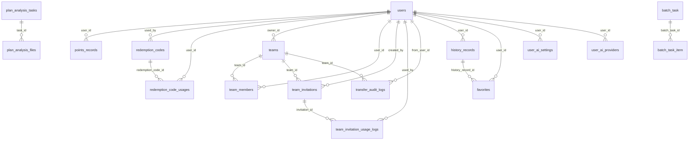
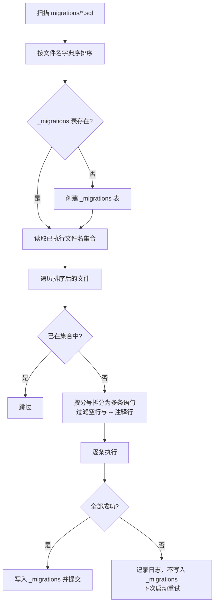

# 数据库搭建指南

本文档说明 EcomAI_image_Studio 的数据库设计、初始化步骤、迁移机制、配置方式与运维建议。

---

## 目录

- [1. 设计概览](#1-设计概览)
- [2. 初始化步骤](#2-初始化步骤)
- [3. 表结构详解](#3-表结构详解)
- [4. 数据迁移机制](#4-数据迁移机制)
- [5. 种子数据](#5-种子数据)
- [6. 配置示例](#6-配置示例)
- [7. 备份与恢复](#7-备份与恢复)
- [8. 注意事项与已知约束](#8-注意事项与已知约束)

---

## 1. 设计概览

### 1.1 基础约定

| 项目 | 取值 |
| --- | --- |
| 数据库 | MySQL 8.0+ |
| 默认库名 | `ecomai_auth` |
| 测试库名 | `ecomai_auth_test` |
| 字符集 | `utf8mb4` |
| 排序规则 | `utf8mb4_unicode_ci` |
| 存储引擎 | InnoDB |
| 主键 | 业务表统一使用自增整数主键（`INT` 或 `BIGINT`） |
| 时间字段 | `DATETIME`，默认 `CURRENT_TIMESTAMP`，更新字段带 `ON UPDATE CURRENT_TIMESTAMP` |
| JSON 字段 | 使用原生 `JSON` 类型存储提示词方案、配置快照、审查结果等半结构化数据 |

### 1.2 表清单

共 **25 张业务表** + 1 张迁移追踪表 `_migrations`（由后端代码运行时创建）。

| 分组 | 表名 | 中文用途 | 创建来源 |
| --- | --- | --- | --- |
| 用户与认证 | `users` | 用户账号表 | `init_db.sql` |
| 用户与认证 | `verification_codes` | 邮箱验证码存储表 | `init_db.sql` |
| 资产与计费 | `points_records` | 灵感币流水表 | `init_db.sql`（字段类型由 `010` 修正） |
| 资产与计费 | `pricing_plans` | 充值定价方案表 | `init_db.sql` |
| 资产与计费 | `redemption_codes` | 兑换码表 | `init_db.sql`（次数限制字段由 `011` 追加） |
| 资产与计费 | `redemption_code_usages` | 兑换码使用明细表 | `init_db.sql` / `011` |
| 资产与计费 | `feature_pricing` | 功能定价表 | `init_db.sql` / `008`（`009` 重建修复） |
| 团队 | `teams` | 团队表 | `init_db.sql` |
| 团队 | `team_members` | 团队成员表 | `init_db.sql` |
| 团队 | `team_invitations` | 团队邀请码表 | `init_db.sql` / `001` |
| 团队 | `team_invitation_usage_logs` | 团队邀请码使用日志表 | `init_db.sql` / `001` |
| 团队 | `transfer_audit_logs` | 转账审计日志表 | `002` |
| 历史与收藏 | `history_records` | 历史记录表 | `init_db.sql` / `005`（数据由 `006` 归一化） |
| 历史与收藏 | `favorites` | 用户收藏表 | `init_db.sql` / `012`（`007` 负责扩展字段） |
| 合规与批量 | `platform_compliance_rules` | 平台合规规则表 | `2026_09_16_upgrade_p0p1.sql` |
| 合规与批量 | `batch_task` | 批量套图编排任务表 | `2026_09_16_upgrade_p0p1.sql` |
| 合规与批量 | `batch_task_item` | 批量套图编排子任务表 | `2026_09_16_upgrade_p0p1.sql`（`size` 列由 `2026_09_17` 追加） |
| 编辑器 | `editor_document` | 编辑器图层文档表 | `2026_09_16_editor_tables.sql` |
| 编辑器 | `editor_task` | 编辑器工具异步任务表 | `2026_09_16_editor_tables.sql` |
| 计划分析 | `plan_analysis_tasks` | 生图计划分析任务表 | `003` |
| 计划分析 | `plan_analysis_files` | 计划分析上传文件表 | `003` |
| BYOK | `user_ai_settings` | 用户自备模型通道开关表 | `2026_09_17_user_ai_providers.sql` |
| BYOK | `user_ai_providers` | 用户自备模型服务商配置（号池）表 | `2026_09_17_user_ai_providers.sql` |
| 运维 | `api_request_logs` | API 请求日志表（仪表盘统计） | `init_db.sql` |
| 运维 | `announcements` | 公告表 | `init_db.sql` |
| 运维 | `_migrations` | 迁移执行追踪表 | `app.py` 运行时创建 |

### 1.3 外键依赖关系



删除策略：

| 关系 | 策略 |
| --- | --- |
| 绝大多数 `user_id` 外键 | `ON DELETE CASCADE`（删除用户即清理其数据） |
| `redemption_codes.used_by` | `ON DELETE SET NULL`（保留兑换码使用痕迹） |
| `transfer_audit_logs.team_id` | `ON DELETE SET NULL`（保留转账审计记录） |
| `batch_task_item.batch_task_id` | 未声明 ON DELETE（默认 RESTRICT） |
| `history_records.shared_team_id` | 仅建索引，**未建外键** |

---

## 2. 初始化步骤

### 2.1 方式一：MySQL 客户端执行初始化脚本（本地开发）

```bash
cd auth-module-backend
mysql -u root -p < init_db.sql
```

`init_db.sql` 会依次完成：

1. 创建数据库 `ecomai_auth`（`utf8mb4` / `utf8mb4_unicode_ci`）。
2. 创建基础表：`users`、`verification_codes`、`points_records`、`pricing_plans`、`redemption_codes`、`redemption_code_usages`、`teams`、`team_members`、`api_request_logs`、`announcements`、`team_invitations`、`team_invitation_usage_logs`、`history_records`、`favorites`、`feature_pricing`。
3. 写入种子数据（见第 5 节）。

> `init_db.sql` **只包含基础表**。`transfer_audit_logs`、`plan_analysis_*`、`editor_*`、`platform_compliance_rules`、`batch_task*`、`user_ai_*` 等表由后端启动时通过 `migrations/` 自动补齐，因此**必须至少成功启动一次后端**。

验证：

```bash
mysql -u root -p -e "USE ecomai_auth; SHOW TABLES;"
```

### 2.2 方式二：Docker Compose（自动执行）

`docker-compose.yml` 已把 `init_db.sql` 挂载到 MySQL 容器的初始化目录：

```yaml
volumes:
  - ./auth-module-backend/init_db.sql:/docker-entrypoint-initdb.d/01-init.sql:ro
```

该脚本**仅在数据卷为空时执行一次**（即首次启动）。其余增量表由 `backend` 服务启动时自动执行迁移补齐。

> 如需重新初始化：`docker compose down -v` 删除数据卷后重新 `up`，**该操作会清空全部数据**。

### 2.3 创建测试库

后端测试使用独立的 `ecomai_auth_test` 库：

```bash
mysql -u root -p -e "CREATE DATABASE IF NOT EXISTS ecomai_auth_test CHARACTER SET utf8mb4 COLLATE utf8mb4_unicode_ci;"
mysql -u root -p ecomai_auth_test < init_db.sql
```

若直接导入会写入 `ecomai_auth` 库，需先修改脚本首行的库名，或导入后重命名：

```bash
mysql -u root -p -e "CREATE DATABASE IF NOT EXISTS ecomai_auth_test CHARACTER SET utf8mb4 COLLATE utf8mb4_unicode_ci;"
mysql -u root -p -e "USE ecomai_auth; SHOW TABLES;" | tail -n +2 | while read t; do
  mysql -u root -p -e "RENAME TABLE ecomai_auth.\`$t\` TO ecomai_auth_test.\`$t\`;"
done
```

> 更简单可靠的做法：复制一份 `init_db.sql`，把 `CREATE DATABASE` 与 `USE` 语句中的库名改为 `ecomai_auth_test` 后导入。

---

## 3. 表结构详解

### 3.1 用户与认证

#### users — 用户账号表

| 字段 | 类型 | 约束 | 默认值 | 说明 |
| --- | --- | --- | --- | --- |
| `id` | INT | PK, AUTO_INCREMENT | — | 用户 ID |
| `email` | VARCHAR(255) | UNIQUE, NOT NULL | — | 登录邮箱 |
| `password_hash` | VARCHAR(255) | NOT NULL | — | bcrypt 密码哈希 |
| `role` | ENUM('admin','user') | NOT NULL | `'user'` | 角色 |
| `personal_points` | INT | — | `0` | 个人钱包灵感币余额 |
| `is_active` | BOOLEAN | — | `TRUE` | 是否启用 |
| `created_at` | DATETIME | — | `CURRENT_TIMESTAMP` | 创建时间 |
| `updated_at` | DATETIME | ON UPDATE | `CURRENT_TIMESTAMP` | 更新时间 |

索引：`UNIQUE(email)`。外键：无。

#### verification_codes — 邮箱验证码存储表

| 字段 | 类型 | 约束 | 默认值 | 说明 |
| --- | --- | --- | --- | --- |
| `id` | INT | PK, AUTO_INCREMENT | — | — |
| `email` | VARCHAR(255) | NOT NULL | — | 目标邮箱 |
| `code` | VARCHAR(6) | NOT NULL | — | 6 位数字验证码 |
| `purpose` | ENUM('login','register','reset_password') | NOT NULL | `'register'` | 用途 |
| `expires_at` | DATETIME | NOT NULL | — | 过期时间 |
| `used` | TINYINT(1) | NOT NULL | `0` | 是否已使用 |
| `created_at` | DATETIME | — | `CURRENT_TIMESTAMP` | 创建时间 |

索引：`idx_email_purpose(email, purpose)`、`idx_expires_at(expires_at)`。外键：无。

---

### 3.2 资产与计费

#### points_records — 灵感币流水表

| 字段 | 类型 | 约束 | 默认值 | 说明 |
| --- | --- | --- | --- | --- |
| `id` | INT | PK, AUTO_INCREMENT | — | — |
| `user_id` | INT | NOT NULL, FK | — | 所属用户 |
| `amount` | INT | NOT NULL | — | 变动数量（消费为负、退款为正） |
| `type` | ENUM('consume','refund','bonus','topup') | NOT NULL | — | 流水类型 |
| `source_wallet` | ENUM('personal','team') | NOT NULL | — | 钱包类型 |
| `team_id` | INT | NULL | — | 团队 ID（团队钱包时） |
| `related_batch_id` | VARCHAR(64) | NULL | — | 关联批次/任务 ID（字符串） |
| `description` | VARCHAR(255) | NOT NULL | — | 描述 |
| `created_at` | DATETIME | — | `CURRENT_TIMESTAMP` | 创建时间 |

索引：`idx_user_id`、`idx_type`、`idx_created_at`。
外键：`user_id → users(id) ON DELETE CASCADE`。

#### pricing_plans — 充值定价方案表

| 字段 | 类型 | 约束 | 默认值 | 说明 |
| --- | --- | --- | --- | --- |
| `id` | INT | PK, AUTO_INCREMENT | — | — |
| `name` | VARCHAR(100) | NOT NULL | — | 套餐名称 |
| `price` | DECIMAL(10,2) | NOT NULL, CHECK(>0) | — | 售价（元） |
| `coins` | INT | NOT NULL, CHECK(>0) | — | 基础灵感币数量 |
| `bonus_coins` | INT | — | `0` | 赠送灵感币 |
| `is_active` | BOOLEAN | — | `TRUE` | 是否上架 |
| `sort_order` | INT | — | `0` | 排序 |
| `created_at` | DATETIME | — | `CURRENT_TIMESTAMP` | 创建时间 |

索引/外键：无。

#### redemption_codes — 兑换码表

| 字段 | 类型 | 约束 | 默认值 | 说明 |
| --- | --- | --- | --- | --- |
| `id` | INT | PK, AUTO_INCREMENT | — | — |
| `code` | VARCHAR(20) | UNIQUE, NOT NULL | — | 兑换码 |
| `coins` | INT | NOT NULL, CHECK(>0) | — | 面额（灵感币） |
| `expires_at` | DATETIME | NOT NULL | — | 过期时间 |
| `is_used` | BOOLEAN | — | `FALSE` | 是否已使用（兼容旧逻辑） |
| `used_by` | INT | NULL, FK | — | 最近使用者 |
| `used_at` | DATETIME | NULL | — | 最近使用时间 |
| `max_uses` | INT | NOT NULL | `1` | 总使用次数上限 |
| `max_uses_per_user` | INT | NOT NULL | `1` | 单账号使用次数上限 |
| `use_count` | INT | NOT NULL | `0` | 当前已使用次数 |
| `remark` | VARCHAR(255) | NULL | — | 备注 |
| `created_at` | DATETIME | — | `CURRENT_TIMESTAMP` | 创建时间 |

索引：`idx_code(code)`、`idx_use_count(use_count)`。
外键：`used_by → users(id) ON DELETE SET NULL`。

#### redemption_code_usages — 兑换码使用明细表

| 字段 | 类型 | 约束 | 默认值 | 说明 |
| --- | --- | --- | --- | --- |
| `id` | INT | PK, AUTO_INCREMENT | — | — |
| `redemption_code_id` | INT | NOT NULL, FK | — | 关联兑换码 |
| `user_id` | INT | NOT NULL, FK | — | 使用用户 |
| `used_at` | DATETIME | — | `CURRENT_TIMESTAMP` | 使用时间 |
| `wallet_type` | VARCHAR(20) | NOT NULL | — | 钱包类型：personal / team |
| `team_id` | INT | NULL | — | 团队 ID |
| `coins_awarded` | INT | NOT NULL | — | 实际发放灵感币数 |

索引：`UNIQUE uk_code_user_time(redemption_code_id, user_id, used_at)`、`idx_redemption_code`、`idx_user`。
外键：`redemption_code_id → redemption_codes(id) ON DELETE CASCADE`；`user_id → users(id) ON DELETE CASCADE`。

#### feature_pricing — 功能定价表

| 字段 | 类型 | 约束 | 默认值 | 说明 |
| --- | --- | --- | --- | --- |
| `id` | INT | PK, AUTO_INCREMENT | — | — |
| `feature_key` | VARCHAR(100) | UNIQUE, NOT NULL | — | 功能唯一标识，如 `ai_product_image.smart_mode` |
| `display_name` | VARCHAR(100) | NOT NULL | — | 展示名称 |
| `category` | VARCHAR(50) | NOT NULL | — | 分组：`ai_product_image` / `ai_toolbox` |
| `pricing_type` | ENUM('per_image_resolution','per_use') | NOT NULL | — | 计价方式 |
| `config` | JSON | NOT NULL | — | 计价配置 |
| `description` | VARCHAR(255) | NULL | — | 描述 |
| `is_active` | BOOLEAN | — | `TRUE` | 是否启用 |
| `sort_order` | INT | — | `0` | 排序 |
| `created_at` | DATETIME | — | `CURRENT_TIMESTAMP` | 创建时间 |
| `updated_at` | DATETIME | ON UPDATE | `CURRENT_TIMESTAMP` | 更新时间 |

索引：`idx_category`、`idx_is_active`。外键：无。

`config` 字段两种结构：

```json
{ "tiers": [
  { "tier": "1K", "max_dimension": 1024, "coins": 5 },
  { "tier": "2K", "max_dimension": 2048, "coins": 10 },
  { "tier": "4K", "max_dimension": 4096, "coins": 15 }
] }
```

```json
{ "coins": 5 }
```

---

### 3.3 团队

#### teams — 团队表

| 字段 | 类型 | 约束 | 默认值 | 说明 |
| --- | --- | --- | --- | --- |
| `id` | INT | PK, AUTO_INCREMENT | — | — |
| `name` | VARCHAR(100) | NOT NULL, UNIQUE | — | 团队名称 |
| `category` | VARCHAR(50) | NOT NULL | — | 团队品类 |
| `owner_id` | INT | NOT NULL, FK | — | 创建者 |
| `member_count` | INT | — | `1` | 成员数 |
| `pool_balance` | INT | — | `0` | 团队钱包余额 |
| `invite_code` | VARCHAR(20) | UNIQUE, NOT NULL | — | 团队邀请码 |
| `created_at` | DATETIME | — | `CURRENT_TIMESTAMP` | 创建时间 |

索引：`UNIQUE idx_team_name(name)`。
外键：`owner_id → users(id) ON DELETE CASCADE`。

#### team_members — 团队成员表

| 字段 | 类型 | 约束 | 默认值 | 说明 |
| --- | --- | --- | --- | --- |
| `id` | INT | PK, AUTO_INCREMENT | — | — |
| `team_id` | INT | NOT NULL, FK | — | 团队 |
| `user_id` | INT | NOT NULL, FK | — | 用户 |
| `role` | ENUM('owner','admin','member') | — | `'member'` | 团队角色 |
| `joined_at` | DATETIME | — | `CURRENT_TIMESTAMP` | 加入时间 |

索引：`UNIQUE unique_team_user(team_id, user_id)`。
外键：`team_id → teams(id) ON DELETE CASCADE`；`user_id → users(id) ON DELETE CASCADE`。

#### team_invitations — 团队邀请码表

| 字段 | 类型 | 约束 | 默认值 | 说明 |
| --- | --- | --- | --- | --- |
| `id` | INT | PK, AUTO_INCREMENT | — | — |
| `team_id` | INT | NOT NULL, FK | — | 团队 |
| `invite_code_hash` | VARCHAR(64) | NOT NULL | — | 邀请码 SHA-256 哈希（用于查找） |
| `invite_code_encrypted` | VARCHAR(255) | NOT NULL | — | AES-256-CBC 加密的原始邀请码 |
| `created_by` | INT | NOT NULL, FK | — | 创建者 |
| `created_at` | DATETIME | — | `CURRENT_TIMESTAMP` | 创建时间 |
| `expires_at` | DATETIME | NOT NULL | — | 过期时间 |
| `is_active` | BOOLEAN | — | `TRUE` | 是否有效 |
| `max_usage` | INT | — | `5` | 最大使用次数 |
| `usage_count` | INT | — | `0` | 已使用次数 |

索引：`idx_team_active(team_id, is_active)`、`idx_code_hash(invite_code_hash)`。
外键：`team_id → teams(id) ON DELETE CASCADE`；`created_by → users(id) ON DELETE CASCADE`。

#### team_invitation_usage_logs — 团队邀请码使用日志表

| 字段 | 类型 | 约束 | 默认值 | 说明 |
| --- | --- | --- | --- | --- |
| `id` | INT | PK, AUTO_INCREMENT | — | — |
| `invitation_id` | INT | NOT NULL, FK | — | 邀请码 |
| `used_by` | INT | NOT NULL, FK | — | 使用者 |
| `used_at` | DATETIME | — | `CURRENT_TIMESTAMP` | 使用时间 |

索引：`idx_invitation_id`。
外键：`invitation_id → team_invitations(id) ON DELETE CASCADE`；`used_by → users(id) ON DELETE CASCADE`。

#### transfer_audit_logs — 转账审计日志表

| 字段 | 类型 | 约束 | 默认值 | 说明 |
| --- | --- | --- | --- | --- |
| `id` | INT | PK, AUTO_INCREMENT | — | — |
| `transfer_type` | ENUM('team_to_owner','personal_to_team') | NOT NULL | — | 转账类型 |
| `from_user_id` | INT | NOT NULL, FK | — | 发起人 |
| `from_wallet` | ENUM('personal','team') | NOT NULL | — | 转出钱包 |
| `team_id` | INT | NULL, FK | — | 关联团队 |
| `to_user_id` | INT | NULL | — | 接收方（团队转个人场景） |
| `to_wallet` | ENUM('personal','team') | NOT NULL | — | 转入钱包 |
| `amount` | INT | NOT NULL | — | 转账金额 |
| `status` | ENUM('success','failed') | NOT NULL | `'success'` | 状态 |
| `error_msg` | VARCHAR(500) | NULL | — | 失败原因 |
| `ip_address` | VARCHAR(45) | NULL | — | 操作 IP |
| `created_at` | DATETIME | — | `CURRENT_TIMESTAMP` | 创建时间 |

索引：`idx_team_id`、`idx_from_user`、`idx_created_at`。
外键：`from_user_id → users(id) ON DELETE CASCADE`；`team_id → teams(id) ON DELETE SET NULL`。

---

### 3.4 历史与收藏

#### history_records — 历史记录表

| 字段 | 类型 | 约束 | 默认值 | 说明 |
| --- | --- | --- | --- | --- |
| `id` | INT | PK, AUTO_INCREMENT | — | — |
| `user_id` | INT | NOT NULL, FK | — | 所属用户 |
| `category` | VARCHAR(50) | NOT NULL | — | 一级类目：`ai_product_image` / `ai_toolbox` |
| `sub_category` | VARCHAR(50) | NOT NULL | — | 二级类目标识符 |
| `title` | VARCHAR(255) | NOT NULL | — | 列表展示标题 |
| `thumbnail_url` | VARCHAR(500) | NULL | — | 缩略图 URL |
| `input_data` | JSON | NOT NULL | — | 输入数据 |
| `output_data` | JSON | NOT NULL | — | 输出数据 |
| `config_snapshot` | JSON | NULL | — | 配置快照（用于「再次生成」） |
| `shared_to_team` | TINYINT(1) | — | `0` | 是否已分享到团队 |
| `shared_team_id` | INT | NULL | — | 分享到的团队 ID |
| `shared_at` | DATETIME | NULL | — | 分享时间 |
| `created_at` | DATETIME | — | `CURRENT_TIMESTAMP` | 创建时间 |

索引：`idx_user_category(user_id, category)`、`idx_user_sub_category(user_id, sub_category)`、`idx_user_created(user_id, created_at DESC)`、`idx_shared_team(shared_team_id)`。
外键：`user_id → users(id) ON DELETE CASCADE`。

> `category` 的取值由迁移 `006` 做过数据归一化，非标准值（中文或简写）会被统一为 `ai_product_image` 或 `ai_toolbox`。

#### favorites — 用户收藏表

| 字段 | 类型 | 约束 | 默认值 | 说明 |
| --- | --- | --- | --- | --- |
| `id` | INT | PK, AUTO_INCREMENT | — | — |
| `user_id` | INT | NOT NULL, FK | — | 所属用户 |
| `target_type` | ENUM('image','history') | NOT NULL | `'image'` | 收藏类型 |
| `image_url` | VARCHAR(500) | NOT NULL | — | 图片 URL（history 类型存缩略图 URL） |
| `batch_id` | INT | NULL | — | 关联批次 |
| `history_record_id` | INT | NULL, FK | — | 关联历史记录（history 类型） |
| `source_user_id` | INT | NULL | — | 团队共享记录的原始所有者 |
| `config` | JSON | NULL | — | 配置快照 |
| `created_at` | DATETIME | — | `CURRENT_TIMESTAMP` | 创建时间 |

索引：`UNIQUE unique_user_history(user_id, history_record_id)`、`idx_history_record(history_record_id)`。
外键：`user_id → users(id) ON DELETE CASCADE`；`fk_fav_history: history_record_id → history_records(id) ON DELETE CASCADE`。

> 该表必须在 `history_records` 之后创建（外键依赖）。

---

### 3.5 合规与批量

#### platform_compliance_rules — 平台合规规则表

| 字段 | 类型 | 约束 | 默认值 | 说明 |
| --- | --- | --- | --- | --- |
| `id` | BIGINT | PK, AUTO_INCREMENT | — | — |
| `platform` | VARCHAR(32) | NOT NULL | — | 平台标识 |
| `image_type` | VARCHAR(32) | NOT NULL | — | 图型 |
| `rules` | JSON | — | — | 图型级规则（背景/占比/文字/尺寸） |
| `global_forbidden` | JSON | — | — | 平台级通用禁元素 |
| `enabled` | TINYINT(1) | NOT NULL | `1` | 是否启用 |
| `created_at` | DATETIME | NOT NULL | `CURRENT_TIMESTAMP` | 创建时间 |
| `updated_at` | DATETIME | NOT NULL, ON UPDATE | `CURRENT_TIMESTAMP` | 更新时间 |

索引：`UNIQUE uk_platform_image_type(platform, image_type)`。外键：无。

#### batch_task — 批量套图编排任务表

| 字段 | 类型 | 约束 | 默认值 | 说明 |
| --- | --- | --- | --- | --- |
| `id` | BIGINT | PK, AUTO_INCREMENT | — | — |
| `task_id` | VARCHAR(64) | NOT NULL, UNIQUE | — | 批次任务 ID（`batch-<uuid>`） |
| `user_id` | BIGINT | NOT NULL | — | 所属用户 |
| `status` | VARCHAR(16) | NOT NULL | `'pending'` | `pending`/`running`/`completed`/`failed`/`partial` |
| `total_items` | INT | NOT NULL | `0` | 子任务总数 |
| `succeeded_items` | INT | NOT NULL | `0` | 成功数 |
| `failed_items` | INT | NOT NULL | `0` | 失败数 |
| `feature_key` | VARCHAR(64) | — | — | 计费功能键 |
| `coins_locked` | INT | NOT NULL | `0` | 预扣灵感币总额 |
| `platform` | VARCHAR(32) | — | — | 平台 |
| `params` | JSON | — | — | 批次参数快照 |
| `created_at` | DATETIME | NOT NULL | `CURRENT_TIMESTAMP` | 创建时间 |
| `updated_at` | DATETIME | NOT NULL, ON UPDATE | `CURRENT_TIMESTAMP` | 更新时间 |

索引：`UNIQUE uk_batch_task_task_id(task_id)`、`KEY idx_batch_task_user(user_id, status)`。外键：无。

#### batch_task_item — 批量套图编排子任务表

| 字段 | 类型 | 约束 | 默认值 | 说明 |
| --- | --- | --- | --- | --- |
| `id` | BIGINT | PK, AUTO_INCREMENT | — | — |
| `batch_task_id` | BIGINT | NOT NULL, FK | — | 所属批次主键 |
| `item_key` | VARCHAR(128) | NOT NULL, UNIQUE | — | 幂等键：`product_site_imagetype` |
| `product_id` | VARCHAR(64) | — | — | 商品 ID |
| `site` | VARCHAR(32) | — | — | 站点码（US / DE / JP …） |
| `image_type` | VARCHAR(32) | — | — | 图型 |
| `size` | VARCHAR(16) | NULL | — | 该子任务分辨率（图组模式逐项尺寸；NULL 回退批次级尺寸） |
| `prompt` | TEXT | — | — | 生成的提示词 |
| `status` | VARCHAR(16) | NOT NULL | `'planned'` | `planned`/`running`/`completed`/`failed` |
| `error` | TEXT | — | — | 失败原因 |
| `result_url` | VARCHAR(512) | — | — | 成图地址 |
| `review` | JSON | — | — | AI 合规审查结果 |
| `coins` | INT | NOT NULL | `0` | 该子任务扣费（失败退款后置 0） |
| `created_at` | DATETIME | NOT NULL | `CURRENT_TIMESTAMP` | 创建时间 |
| `updated_at` | DATETIME | NOT NULL, ON UPDATE | `CURRENT_TIMESTAMP` | 更新时间 |

索引：`UNIQUE uk_batch_item_key(item_key)`、`KEY idx_batch_item_batch_status(batch_task_id, status)`。
外键：`fk_batch_item_task: batch_task_id → batch_task(id)`（未声明 ON DELETE，默认 RESTRICT）。

> `size` 列由迁移 `2026_09_17_batch_item_size.sql` 追加，位置在 `image_type` 之后。因此 `2026_09_16_upgrade_p0p1.sql` 必须先于它执行（文件名前缀已固定以保证顺序）。

---

### 3.6 编辑器

#### editor_document — 编辑器图层文档表

| 字段 | 类型 | 约束 | 默认值 | 说明 |
| --- | --- | --- | --- | --- |
| `id` | BIGINT | PK, AUTO_INCREMENT | — | — |
| `user_id` | BIGINT | NOT NULL | — | 所属用户 |
| `source_image_id` | VARCHAR(64) | NULL | — | 来源图片标识 |
| `title` | VARCHAR(255) | — | `''` | 文档标题 |
| `layers` | JSON | NULL | — | 图层数据 |
| `created_at` | DATETIME | — | `CURRENT_TIMESTAMP` | 创建时间 |
| `updated_at` | DATETIME | ON UPDATE | `CURRENT_TIMESTAMP` | 更新时间 |

索引：`idx_user`。外键：无。

#### editor_task — 编辑器工具异步任务表

| 字段 | 类型 | 约束 | 默认值 | 说明 |
| --- | --- | --- | --- | --- |
| `id` | BIGINT | PK, AUTO_INCREMENT | — | — |
| `task_id` | VARCHAR(64) | NOT NULL, UNIQUE | — | 任务 ID（uuid hex） |
| `user_id` | BIGINT | NOT NULL | — | 所属用户 |
| `tool` | VARCHAR(64) | NULL | — | 工具名 |
| `params` | JSON | NULL | — | 工具参数 |
| `status` | VARCHAR(16) | — | `'queued'` | `queued`/`running`/`completed`/`failed` |
| `result_url` | VARCHAR(512) | NULL | — | 结果图 URL |
| `error` | VARCHAR(1024) | NULL | — | 失败原因 |
| `created_at` | DATETIME | — | `CURRENT_TIMESTAMP` | 创建时间 |
| `updated_at` | DATETIME | ON UPDATE | `CURRENT_TIMESTAMP` | 更新时间 |

索引：`UNIQUE uk_task_id(task_id)`、`idx_user`。外键：无。

---

### 3.7 生图计划分析

#### plan_analysis_tasks — 生图计划分析任务表

| 字段 | 类型 | 约束 | 默认值 | 说明 |
| --- | --- | --- | --- | --- |
| `id` | INT | PK, AUTO_INCREMENT | — | — |
| `user_id` | INT | NOT NULL | — | 所属用户（未建外键） |
| `status` | VARCHAR(20) | NOT NULL | `'pending'` | `pending`/`processing`/`completed`/`failed` |
| `input_hash` | VARCHAR(64) | NOT NULL | `''` | 请求内容哈希（用于缓存） |
| `result_json` | TEXT | NULL | — | 分析结果 JSON |
| `error_message` | TEXT | NULL | — | 错误信息 |
| `created_at` | DATETIME | NOT NULL | `CURRENT_TIMESTAMP` | 创建时间 |
| `updated_at` | DATETIME | NOT NULL, ON UPDATE | `CURRENT_TIMESTAMP` | 更新时间 |

索引：`idx_user_id`、`idx_input_hash`、`idx_status`、`idx_user_created(user_id, created_at)`。外键：无。

#### plan_analysis_files — 计划分析上传文件表

| 字段 | 类型 | 约束 | 默认值 | 说明 |
| --- | --- | --- | --- | --- |
| `id` | INT | PK, AUTO_INCREMENT | — | — |
| `task_id` | INT | NOT NULL, FK | — | 关联任务 |
| `file_name` | VARCHAR(255) | NOT NULL | — | 文件名 |
| `file_size` | BIGINT | NOT NULL | `0` | 文件大小（字节） |
| `file_type` | VARCHAR(50) | NOT NULL | `''` | 文件类型/扩展名 |
| `storage_path` | VARCHAR(500) | NOT NULL | `''` | 存储路径 |
| `created_at` | DATETIME | NOT NULL | `CURRENT_TIMESTAMP` | 创建时间 |

索引：`idx_task_id`。
外键：`fk_plan_files_task: task_id → plan_analysis_tasks(id) ON DELETE CASCADE`。

---

### 3.8 自带模型通道（BYOK）

#### user_ai_settings — 用户自备模型通道开关表

| 字段 | 类型 | 约束 | 默认值 | 说明 |
| --- | --- | --- | --- | --- |
| `user_id` | INT | PK（非自增） | — | 用户 ID |
| `use_own_provider` | TINYINT(1) | NOT NULL | `0` | 是否优先使用自备通道 |
| `created_at` | DATETIME | NOT NULL | `CURRENT_TIMESTAMP` | 创建时间 |
| `updated_at` | DATETIME | NOT NULL, ON UPDATE | `CURRENT_TIMESTAMP` | 更新时间 |

外键：`fk_user_ai_settings_user: user_id → users(id) ON DELETE CASCADE`。

#### user_ai_providers — 用户自备模型服务商配置（号池）表

| 字段 | 类型 | 约束 | 默认值 | 说明 |
| --- | --- | --- | --- | --- |
| `id` | BIGINT | PK, AUTO_INCREMENT | — | — |
| `user_id` | INT | NOT NULL, FK | — | 所属用户 |
| `category` | VARCHAR(32) | NOT NULL | — | 通道分类：`image_gen`/`multimodal`/`llm` |
| `name` | VARCHAR(64) | NOT NULL | — | 用户自定义备注名 |
| `api_base` | VARCHAR(255) | NOT NULL | — | API 基址 |
| `api_key_cipher` | TEXT | NOT NULL | — | AES 加密后的 API Key |
| `model_name` | VARCHAR(128) | NOT NULL | — | 模型名 |
| `priority` | INT | NOT NULL | `0` | 号池优先级（升序尝试） |
| `is_enabled` | TINYINT(1) | NOT NULL | `1` | 是否启用 |
| `last_test_ok` | TINYINT(1) | NULL | — | 最近连通性测试结果 |
| `last_test_at` | DATETIME | NULL | — | 最近测试时间 |
| `last_test_error` | VARCHAR(500) | NULL | — | 最近测试失败原因 |
| `last_used_at` | DATETIME | NULL | — | 最近实际调用时间 |
| `failure_count` | INT | NOT NULL | `0` | 累计调用失败次数 |
| `last_error` | VARCHAR(500) | NULL | — | 最近调用失败原因 |
| `created_at` | DATETIME | NOT NULL | `CURRENT_TIMESTAMP` | 创建时间 |
| `updated_at` | DATETIME | NOT NULL, ON UPDATE | `CURRENT_TIMESTAMP` | 更新时间 |

索引：`KEY idx_user_category(user_id, category, priority)`。
外键：`fk_user_ai_provider_user: user_id → users(id) ON DELETE CASCADE`。

> `api_key_cipher` 使用 `USER_AI_KEY_ENCRYPTION_KEY` 做 AES-256-CBC 加密。**更换该密钥会导致已存储的 Key 无法解密**，需在变更前通知用户重新填写。

---

### 3.9 运维

#### api_request_logs — API 请求日志表

| 字段 | 类型 | 约束 | 默认值 | 说明 |
| --- | --- | --- | --- | --- |
| `id` | INT | PK, AUTO_INCREMENT | — | — |
| `model_name` | VARCHAR(20) | NOT NULL | — | 模型标识（qwen / gpt） |
| `status` | ENUM('success','failed') | NOT NULL | — | 状态 |
| `latency_ms` | INT | NOT NULL | — | 延迟（毫秒） |
| `created_at` | DATETIME | — | `CURRENT_TIMESTAMP` | 创建时间 |

索引：`idx_model_name`、`idx_created_at`、`idx_status`。外键：无。

> 该表由管理后台仪表盘使用，**没有对应的模型文件**（由服务层直接查询）。

#### announcements — 公告表

| 字段 | 类型 | 约束 | 默认值 | 说明 |
| --- | --- | --- | --- | --- |
| `id` | INT | PK, AUTO_INCREMENT | — | — |
| `title` | VARCHAR(200) | NOT NULL | — | 标题 |
| `content` | TEXT | NOT NULL | — | 内容 |
| `type` | ENUM('info','warning','success','important') | — | `'info'` | 类型 |
| `is_pinned` | BOOLEAN | — | `FALSE` | 是否置顶 |
| `is_active` | BOOLEAN | — | `TRUE` | 是否启用 |
| `created_by` | VARCHAR(255) | NULL | — | 创建者标识 |
| `expires_at` | DATETIME | NULL | — | 过期时间 |
| `created_at` | DATETIME | — | `CURRENT_TIMESTAMP` | 创建时间 |
| `updated_at` | DATETIME | ON UPDATE | `CURRENT_TIMESTAMP` | 更新时间 |

索引：`idx_is_active`、`idx_is_pinned`、`idx_created_at`。外键：无。

#### _migrations — 迁移执行追踪表

由后端代码在启动时自动创建，**不由任何 SQL 文件定义**。

| 字段 | 类型 | 约束 | 说明 |
| --- | --- | --- | --- |
| `id` | INT | PK, AUTO_INCREMENT | — |
| `filename` | VARCHAR(255) | NOT NULL, UNIQUE | 已执行的迁移文件名 |
| `executed_at` | DATETIME | DEFAULT CURRENT_TIMESTAMP | 执行时间 |

---

## 4. 数据迁移机制

### 4.1 执行入口

后端启动时，`app.py` 的 `create_app()` 在注册蓝图之前依次执行：

```
_run_migrations()        → 执行 migrations/ 下未执行过的 SQL
_seed_feature_pricing()  → 功能定价表为空时写入默认定价
_seed_compliance_rules() → 按平台补齐合规规则种子
```

### 4.2 迁移执行流程



### 4.3 迁移文件清单

| 文件名 | 用途 |
| --- | --- |
| `001_add_team_invitations.sql` | 新增 `team_invitations`、`team_invitation_usage_logs` |
| `002_add_transfer_logs.sql` | 新增 `transfer_audit_logs` |
| `003_add_plan_analysis_tables.sql` | 新增 `plan_analysis_tasks`、`plan_analysis_files` |
| `005_add_history_records.sql` | 新增 `history_records` |
| `006_normalize_history_categories.sql` | 数据迁移：把 `history_records.category` 的非标准值归一为 `ai_product_image` / `ai_toolbox`（无 DDL） |
| `007_add_history_favorites.sql` | 扩展 `favorites` 支持收藏历史记录（新增 `target_type`、`history_record_id`、`source_user_id`，重建唯一键与外键） |
| `008_add_feature_pricing.sql` | 新增 `feature_pricing`（旧版结构） |
| `009_fix_feature_pricing_schema.sql` | 备份并重建 `feature_pricing`，补齐缺失列后回填数据 |
| `010_fix_points_records_related_batch_id.sql` | 修正 `points_records.related_batch_id` 类型（INT → VARCHAR(64)） |
| `011_add_redemption_limits.sql` | 兑换码增加次数限制字段与 `redemption_code_usages` 表 |
| `012_create_favorites_table.sql` | 在缺失 `favorites` 的环境直接创建完整 schema，并把 `007` 标记为已执行 |
| `2026_09_16_editor_tables.sql` | 新增 `editor_document`、`editor_task` |
| `2026_09_16_upgrade_p0p1.sql` | 新增 `platform_compliance_rules`、`batch_task`、`batch_task_item` |
| `2026_09_17_batch_item_size.sql` | 为 `batch_task_item` 追加 `size` 列 |
| `2026_09_17_user_ai_providers.sql` | 新增 `user_ai_settings`、`user_ai_providers` |

> 目录中**不存在 004 编号文件**，编号序列为 001、002、003、005 … 012，随后是 4 个日期前缀文件。

### 4.4 执行顺序

排序为**文件名字典序**，实际效果：

```
001 → 002 → 003 → 005 → 006 → 007 → 008 → 009 → 010 → 011 → 012
  → 2026_09_16_editor_tables → 2026_09_16_upgrade_p0p1
  → 2026_09_17_batch_item_size → 2026_09_17_user_ai_providers
```

`2026_09_16_upgrade_p0p1.sql` 的前缀被刻意固定为 `2026_09_16`，以保证 `batch_task_item` 建表先于 `2026_09_17_batch_item_size.sql` 的 `ADD COLUMN size`。**新增迁移文件时不要修改既有文件的前缀。**

### 4.5 新增迁移文件的规范

1. 文件名使用 `NNN_描述.sql`（顺序号）或 `YYYY_MM_DD_描述.sql`（日期）前缀。
2. 所有 DDL 使用 `CREATE TABLE IF NOT EXISTS` / `ADD COLUMN IF NOT EXISTS` 等幂等写法（MySQL 8.0 对 `ADD COLUMN IF NOT EXISTS` 支持有限，可用 `ALTER TABLE ... ADD COLUMN` 并接受失败重试）。
3. 数据变更（`UPDATE`）也要幂等，因为失败的迁移会在下次启动重试。
4. 文件内**不要使用存储过程或 `DELIMITER`**，执行器只做朴素的分号拆分。
5. 避免在字符串字面量或 JSON 中出现分号，否则会被错误拆分。

---

## 5. 种子数据

### 5.1 `init_db.sql` 写入的种子数据

| 目标表 | 内容 |
| --- | --- |
| `users` | 2 个开发测试账号（1 个管理员、1 个普通用户），密码为 bcrypt 哈希 |
| `pricing_plans` | 5 个充值套餐（体验包 / 入门包 / 进阶包 / 专业包 / 企业包，其中企业包默认下架） |
| `redemption_codes` | 3 个示例兑换码（`WELCOME2026` / `VIPGIFT50` / `BETA88`） |
| `teams` | 5 个示例团队 |
| `team_members` | 5 条 owner 关联记录 |
| `announcements` | 3 条示例公告 |
| `api_request_logs` | 近 24 小时的模拟请求日志（用于仪表盘展示） |
| `feature_pricing` | 10 条默认功能定价 |

> **开发测试账号仅用于本地开发与自动化测试**，上线前必须修改密码或删除，详见 [SECURITY.md](SECURITY.md)。

### 5.2 后端启动时写入的种子数据

**功能定价** `_seed_feature_pricing`：仅当 `feature_pricing` 表**为空**时写入。数据源为 `services/feature_pricing_service.py` 的 `FEATURE_KEY_REGISTRY`：

- `per_image_resolution` 类型写入三档：1K = 5 币、2K = 10 币、4K = 15 币。
- 其余类型写入 `{"coins": 5}`。

**平台合规规则** `_seed_compliance_rules`：按**平台粒度**补齐，已存在的平台跳过。数据源为 `app.py` 中的 `_COMPLIANCE_SEEDS` 常量，覆盖 6 个平台 × 3 类图型，并附带平台级通用禁元素。

---

## 6. 配置示例

### 6.1 本地开发（`.env`）

```dotenv
MYSQL_HOST=localhost
MYSQL_PORT=3306
MYSQL_USER=root
MYSQL_PASSWORD=<your-db-password>
MYSQL_DATABASE=ecomai_auth
```

### 6.2 Docker Compose（根目录 `.env`）

```dotenv
MYSQL_ROOT_PASSWORD=<strong-random-password>
MYSQL_DATABASE=ecomai_auth
MYSQL_HOST_PORT=3307
```

容器内的 `MYSQL_HOST` / `MYSQL_PORT` 由 `docker-compose.yml` 固定为 `mysql` / `3306`，无需在 `.env` 中配置。

### 6.3 MySQL 服务端建议参数

`docker-compose.yml` 中已配置：

```
--character-set-server=utf8mb4
--collation-server=utf8mb4_unicode_ci
--default-authentication-plugin=mysql_native_password
--max_connections=300
```

说明：

- `utf8mb4` 是存储 emoji 与多语言文案的必要条件。
- 使用 `mysql_native_password` 是因为 PyMySQL 未引入 `cryptography` 依赖，使用 `caching_sha2_password` 会导致认证失败。
- `max_connections=300` 用于支撑批量任务与多进程并发。

### 6.4 应用侧连接参数

| 参数 | 来源 | 说明 |
| --- | --- | --- |
| 连接方式 | PyMySQL 短连接 | 每次操作建立连接，`finally` 中关闭 |
| 字符集 | `utf8mb4` | 与库表一致 |
| 隔离级别 | MySQL 默认（REPEATABLE READ） | 扣费使用 `SELECT ... FOR UPDATE` 行级锁保证一致性 |

### 6.5 连接验证示例

```bash
# 使用应用配置的账号验证连通性
mysql -h 127.0.0.1 -P 3306 -u root -p ecomai_auth -e "SELECT VERSION(), DATABASE();"

# 查看关键表数据量
mysql -h 127.0.0.1 -P 3306 -u root -p ecomai_auth -e "
SELECT 'users' AS t, COUNT(*) AS c FROM users
UNION ALL SELECT 'feature_pricing', COUNT(*) FROM feature_pricing
UNION ALL SELECT 'platform_compliance_rules', COUNT(*) FROM platform_compliance_rules
UNION ALL SELECT 'pricing_plans', COUNT(*) FROM pricing_plans;"
```

---

## 7. 备份与恢复

### 7.1 逻辑备份

```bash
# 全库备份（含建表语句与数据）
mysqldump -u root -p --single-transaction --routines --triggers \
  --default-character-set=utf8mb4 ecomai_auth > ecomai_auth_$(date +%Y%m%d_%H%M%S).sql

# 仅结构
mysqldump -u root -p --no-data ecomai_auth > ecomai_auth_schema.sql

# 仅数据（不含建表）
mysqldump -u root -p --no-create-info ecomai_auth > ecomai_auth_data.sql
```

### 7.2 恢复

```bash
mysql -u root -p -e "CREATE DATABASE IF NOT EXISTS ecomai_auth CHARACTER SET utf8mb4 COLLATE utf8mb4_unicode_ci;"
mysql -u root -p ecomai_auth < ecomai_auth_backup.sql
```

> 恢复后请确认 `_migrations` 表内容完整，否则后端启动时会重复执行迁移。由于所有迁移均按幂等编写，通常不会造成数据损坏，但 `006` 的数据归一化会重复执行（幂等）。

### 7.3 Docker 环境备份

```bash
# 备份
docker compose exec -T mysql mysqldump -u root -p"$MYSQL_ROOT_PASSWORD" \
  --single-transaction --default-character-set=utf8mb4 ecomai_auth > backup.sql

# 恢复
docker compose exec -T mysql mysql -u root -p"$MYSQL_ROOT_PASSWORD" ecomai_auth < backup.sql

# 同时备份上传的图片文件
docker run --rm -v all_images_backend_uploads:/data -v "$PWD":/backup alpine \
  tar czf /backup/uploads_$(date +%Y%m%d).tar.gz -C /data .
```

### 7.4 备份建议

| 对象 | 频率 | 说明 |
| --- | --- | --- |
| `ecomai_auth` 数据库 | 每日 | 核心业务数据 |
| `backend_uploads` 卷 | 每日或每周 | 生成的图片与上传文件，体积增长较快 |
| Redis 数据 | 可选 | 仅存任务状态，丢失可重新提交任务 |

---

## 8. 注意事项与已知约束

### 8.1 迁移执行器的限制

`_run_migrations` 使用**朴素的分号拆分**（`sql_content.split(';')`），存在以下结构性限制：

1. **不识别字符串或 JSON 中的分号**，含分号的字面量会被错误切断（当前迁移文件未触发该问题）。
2. **不支持 `DELIMITER` 与存储过程**。
3. 拆分后按行过滤以 `--` 开头的注释行；`/* */` 块注释不会被过滤。

新增迁移时请遵守第 4.5 节的规范。

### 8.2 迁移失败不阻断启动

任一迁移失败只记录日志且**不写入 `_migrations`**，因此：

- 该文件会在**每次启动时重试**。
- 由于 MySQL DDL 隐式提交，失败文件内已执行的语句不会回滚。
- 后续迁移文件仍会继续执行。

因此迁移语句必须写成幂等形式。

### 8.3 `init_db.sql` 与迁移存在重复定义

以下表在 `init_db.sql` 与迁移文件中均有定义，依赖 `CREATE TABLE IF NOT EXISTS` 保持幂等：

`team_invitations`、`team_invitation_usage_logs`、`history_records`、`feature_pricing`、`redemption_code_usages`、`favorites`。

其中 `007` 是纯 `ALTER TABLE` 语句，若 `favorites` 不存在会失败——这正是 `012_create_favorites_table.sql` 存在的原因（它直接创建完整表结构并把 `007` 标记为已执行）。

### 8.4 表与模型的不一致点

| 情况 | 说明 |
| --- | --- |
| `api_request_logs` | 有表，无对应模型文件（由服务层直接查询） |
| `generation_task.py` | 有模型文件，但**不映射任何表**，是纯内存数据结构（配合 Redis 使用） |
| `_migrations` | 无模型文件、无 SQL 文件，由代码运行时创建 |
| `batch_task_item.size` | 列顺序依赖 `2026_09_16_upgrade_p0p1.sql` 先执行 |

### 8.5 其他约束

- **`points_records.related_batch_id` 为字符串类型**（VARCHAR(64)），因为批量任务 ID 形如 `batch-<uuid>`。
- **`history_records.shared_team_id` 无外键约束**，删除团队不会级联清理分享记录，查询时需自行容错。
- **`batch_task_item.batch_task_id` 未声明 ON DELETE**，删除批次前需先删除子任务。
- **`favorites` 的唯一键 `unique_user_history(user_id, history_record_id)`** 对 `image` 类型记录而言 `history_record_id` 为 NULL，MySQL 允许 NULL 重复，因此不影响图片收藏。
- **`user_ai_providers.api_key_cipher` 依赖 `USER_AI_KEY_ENCRYPTION_KEY`**，更换密钥会导致存量数据无法解密。
