# 功能模块详解

本文档系统介绍 EcomAI_image_Studio 各功能模块的架构、核心算法、使用流程与界面说明。

文中流程图使用 Mermaid 编写，可在 GitHub 上直接渲染。

---

## 目录

- [1. 模块总览](#1-模块总览)
- [2. 异步任务与 SSE 基础设施](#2-异步任务与-sse-基础设施)
- [3. 认证与权限模块](#3-认证与权限模块)
- [4. 计费与钱包模块](#4-计费与钱包模块)
- [5. 多语言 / 多站点提示词引擎](#5-多语言--多站点提示词引擎)
- [6. 平台合规模块](#6-平台合规模块)
- [7. AI 商品图 - 简单模式](#7-ai-商品图---简单模式)
- [8. AI 商品图 - 专业模式](#8-ai-商品图---专业模式)
- [9. 批量套图编排](#9-批量套图编排)
- [10. 风格锁定](#10-风格锁定)
- [11. AI 图片编辑器](#11-ai-图片编辑器)
- [12. AI 工具箱](#12-ai-工具箱)
- [13. 历史记录与收藏](#13-历史记录与收藏)
- [14. 团队协作模块](#14-团队协作模块)
- [15. 自带模型通道（BYOK）](#15-自带模型通道byok)
- [16. 管理后台](#16-管理后台)
- [17. 前端页面地图](#17-前端页面地图)

---

## 1. 模块总览

### 1.1 后端分层

```
routes/          路由层：HTTP 契约、参数校验、鉴权装饰器、任务受理
   │
controllers/     控制器层：编辑器 Agent 编排、图层文档校验
   │
workflows/       工作流层：LangGraph 状态图（简单模式 / 专业模式生图链路）
services/        服务层：业务逻辑、外部 AI 调用、任务队列、存储
   │
models/          数据访问层：裸 SQL + 参数化查询
   │
MySQL / Redis    存储层
```

分层约定：

- **路由层不写业务逻辑**，只做参数解析、鉴权、计费与任务提交。
- **服务层不感知 HTTP**，抛出的业务异常由 `AuthError` 统一映射为响应信封。
- **提示词模板与合规规则数据化**，不硬编码在业务流程中。

### 1.2 路由蓝图清单

| 蓝图文件 | 前缀 | 职责 |
| --- | --- | --- |
| `routes/auth.py` | `/api/v1` | 注册、登录、验证码、重置密码、用户资料与余额 |
| `routes/generation.py` | `/api/v1` | AI 商品图简单模式与专业模式 |
| `routes/batch_routes.py` | `/api/v1/batch` | 批量套图编排 |
| `routes/editor_routes.py` | `/api/v1/editor` | AI 图片编辑器工具、文档、Agent |
| `routes/toolbox.py` | `/api/v1/toolbox` | AI 工具箱 8 个工具 |
| `routes/compliance_routes.py` | `/api/v1/compliance` | 平台合规规则查询与单图审查 |
| `routes/template_routes.py` | `/api/v1/template` | 提示词预览与站点/场景/图型选项 |
| `routes/images.py` | `/api/v1` | 图片与缩略图访问 |
| `routes/sse_routes.py` | `/api/v1/sse` | 任务进度 SSE 流 |
| `routes/history.py` | `/api/v1` | 历史记录 CRUD 与团队分享 |
| `routes/favorite.py` | `/api/v1` | 收藏管理 |
| `routes/team.py` | `/api/v1` | 团队、邀请码、成员、转账 |
| `routes/purchase.py` | `/api/v1` | 定价方案、兑换码充值 |
| `routes/feature_pricing.py` | `/api/v1/feature-pricing` | 功能定价查询 |
| `routes/user_ai_provider.py` | `/api/v1` | 自带模型通道配置 |
| `routes/admin.py` | `/api/v1/admin` | 管理后台全部接口 |
| `routes/announcement.py` | `/api/v1` | 公开公告 |
| `app.py` 内置 | `/`、`/api/v1/health` | 版本信息与健康检查 |

### 1.3 统一响应契约

所有接口返回统一信封：

```json
{ "code": 0, "message": "success", "data": { } }
```

`code === 0` 表示业务成功；非 0 时 `data` 为 `null`，`message` 为可读错误描述。

常用错误码：

| 错误码 | HTTP | 含义 |
| --- | --- | --- |
| 0 | 200 / 201 | 成功 |
| 1001 | 401 | 未登录或凭证无效 |
| 1002 | 401 | Token 无效或已过期 |
| 1003 | 403 | 权限不足 |
| 2006 | 409 | 邮箱已被注册 |
| 3002 | 400 | 参数格式错误 |
| 3008 | 429 | 请求过于频繁 |
| 3009 | 400 | 验证码无效或已过期 |
| 5001 | 500 / 404 / 405 | 服务器内部错误或路由不存在 |

---

## 2. 异步任务与 SSE 基础设施

这是所有耗时功能（生图、批量、工具箱、编辑器）的公共底座。

### 2.1 组件构成

| 文件 | 职责 |
| --- | --- |
| `services/task_queue.py` | 任务注册表、任务提交、任务状态读写、事件发布 |
| `services/task_state_sync.py` | 同步版状态写入，供同步业务代码在线程池中调用 |
| `services/generation_store.py` | 生图任务/批次的 Redis 存储适配层（兼容 dict 语义） |
| `worker.py` | ARQ Worker 入口与任务注册 |

### 2.2 任务生命周期

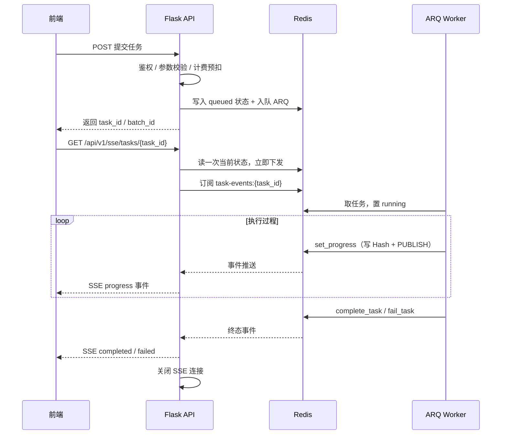

### 2.3 任务状态模型

| 字段 | 说明 |
| --- | --- |
| `status` | `queued` / `running` / `completed` / `failed` |
| `step` | 当前步骤的中文描述 |
| `pct` | 进度百分比（0-100） |
| `result` | 成功结果 |
| `error` | 失败原因 |
| `module` | 所属业务模块 |

### 2.4 Redis Key 约定

| Key / 频道 | 用途 |
| --- | --- |
| `task:{task_id}` | 任务状态 Hash（供 SSE 建连时读取初始状态） |
| `task-events:{task_id}` | 任务事件 Pub/Sub 频道 |
| `generation:tasks` | 生图任务集合 |
| `generation:batches` | 批次到任务列表的映射 |
| `generation:batchctx` | 批次上下文（供失败重试） |
| `generation:pro_batches` | 专业模式批次 |
| `agent-plan:{task_id}:cancel` | 编辑器 Agent 取消标记 |
| `agent-plan:{task_id}:step:{id}` | Agent 单步中间产物（供单步重试） |

任务状态默认保留 `TASK_RESULT_TTL`（86400 秒），生图存储默认保留 7 天。

### 2.5 关键实现细节

- **写透字典**：`generation_store` 用 dict 子类包装 Redis Hash，业务代码仍以 `task["status"] = ...` 方式原地修改，赋值时自动序列化写回 Redis，避免大规模改造既有代码。
- **事件镜像**：每次写回同时把状态镜像写入 `task:{id}` 并发布到 `task-events:{id}`，保证 SSE 的「首帧状态」与「增量事件」形状一致。
- **ARQ 兼容垫片**：`task_state_sync` 为 `ArqRedis` 补 `closed` 只读属性，修复同进程二次提交任务时的 `AttributeError`。
- **批次事件聚合**：批次级事件会把各子任务状态聚合成一个整体进度再发布，前端无需自行汇总。

### 2.6 前端订阅：useTaskSse

`src/composables/useTaskSse.ts` 封装了订阅逻辑：

- 通过 `EventSource` 连接 `/api/v1/sse/tasks/{taskId}?token=<jwt>`（EventSource 无法自定义请求头，故 token 走查询参数）。
- 监听 `progress` / `completed` / `failed` 三类事件。
- **降级策略**：连续 3 次连接错误后自动切换为 2 秒间隔的轮询（调用各模块的状态查询接口）；运行环境不支持 `EventSource` 时直接使用轮询。
- 组件卸载时自动关闭连接。

---

## 3. 认证与权限模块

### 3.1 架构

| 文件 | 职责 |
| --- | --- |
| `routes/auth.py` | 认证相关路由 |
| `controllers/auth_controller.py` | 请求解析与响应组装 |
| `services/auth_service.py` | 注册、登录、密码重置业务逻辑 |
| `services/verification_service.py` | 验证码生成、存储、校验、频控 |
| `services/email_service.py` | SMTP 邮件发送 |
| `middleware/auth_middleware.py` | JWT 校验与 RBAC 装饰器 |
| `utils/security.py` | bcrypt 密码哈希、JWT 签发/校验、内存限流器 |

### 3.2 鉴权机制

- 登录成功后签发 JWT，算法 `HS256`，有效期 **24 小时**，载荷包含 `sub`（用户 ID 字符串）、`email`、`role`、`iat`、`exp`。
- 请求头 `Authorization: Bearer <token>` 携带令牌。
- `@token_required` 校验令牌并把 `{user_id, email, role}` 注入 `g.current_user`。
- `@require_role('admin')` 做角色校验，必须置于 `@token_required` 之后。
- 密码使用 **bcrypt** 加盐哈希存储，不落明文。

### 3.3 限流策略

| 场景 | 限制 | 维度 |
| --- | --- | --- |
| 全站接口 | `RATE_LIMIT_PER_MINUTE`（默认 200 次/分钟） | IP |
| 登录 | 60 秒内最多 5 次 | IP |
| 注册 | 60 秒内最多 3 次 | IP |
| 重置密码 | 60 秒内最多 3 次 | IP |
| 验证码发送 | 60 秒内最多 1 次 | 邮箱 |
| 验证码发送 | 每日最多 10 次 | 邮箱 |

全局限流由 `flask-limiter` 实现；业务级限流由 `utils/security.py` 的内存限流器实现。

> 部署在反向代理之后时，必须设置 `TRUST_PROXY_HEADERS=true`，否则 `remote_addr` 恒为代理 IP，全局限流会退化为所有用户共享同一配额。

### 3.4 验证码机制

- 6 位纯数字，有效期 **300 秒**。
- 用途枚举：`login` / `register` / `reset_password`。
- 存储于 `verification_codes` 表，含 `used` 标记防止重复使用。

### 3.5 使用流程

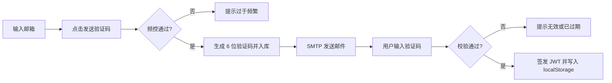

### 3.6 界面说明

- **登录页** `views/LoginView.vue`：登录 / 注册双 Tab；登录支持「密码登录」与「验证码登录」两种模式；含验证码倒计时与轮播图。
- **忘记密码页** `views/ForgotPasswordView.vue`：三阶段 `email → verify → success`，邮箱域名支持自动补全。
- 登录令牌存储于 `localStorage` 的 `ecomai_token` 键；`stores/auth.ts` 在初始化时读取令牌并拉取用户资料，认证类错误会自动清除令牌。

---

## 4. 计费与钱包模块

### 4.1 架构

| 文件 | 职责 |
| --- | --- |
| `services/feature_pricing_service.py` | 定价注册表、费用计算、扣费与退款 |
| `services/points_record_service.py` | 灵感币流水查询与余额读取 |
| `services/purchase_service.py` | 充值套餐与兑换码核销 |
| `routes/purchase.py`、`routes/feature_pricing.py` | 对外接口 |

### 4.2 计价模型

两种计价方式：

| 计价类型 | 适用 | 规则 |
| --- | --- | --- |
| `per_image_resolution` | AI 商品图（简单/专业/批量） | 按生成图片的最长边就近匹配档位：1K（≤1024）5 币、2K（≤2048）10 币、4K（≤4096）15 币 |
| `per_use` | AI 工具箱全部工具 | 每次调用固定消耗，默认 5 币 |

功能定价注册表 `FEATURE_KEY_REGISTRY` 共 11 项：

| feature_key | 展示名称 | 计价类型 |
| --- | --- | --- |
| `ai_product_image.smart_mode` | AI 商品图 - 简单模式 | 按分辨率 |
| `ai_product_image.pro_mode` | AI 商品图 - 专业模式 | 按分辨率 |
| `ai_product_image.batch` | AI 商品图 - 批量套图 | 按分辨率 |
| `toolbox.text_to_image` | 文生图 | 按次 |
| `toolbox.image_merge` | 图片合并 | 按次 |
| `toolbox.plan_analysis` | 生图计划分析 | 按次 |
| `toolbox.chat_gen` | 对话式生图 | 按次 |
| `toolbox.product_replace` | 产品替换 | 按次 |
| `toolbox.ai_model` | AI 模特 | 按次 |
| `toolbox.model_product` | 模特商品图 | 按次 |
| `toolbox.prompt_reverse` | 反推提示词 | 按次 |

定价可在管理后台动态调整，前端通过 `/api/v1/feature-pricing` 获取并做本地缓存（60 秒）。

### 4.3 双钱包与扣费事务

- 每个用户有**个人钱包**（`users.personal_points`），每个团队有**团队钱包**（`teams.pool_balance`）。
- 扣费在单个数据库连接内完成事务：

```
BEGIN
  SELECT ... FOR UPDATE      -- 行级锁锁定余额行
  校验余额是否充足
  UPDATE 余额
  INSERT points_records      -- consume 记负数
COMMIT
```

- 退款写入 `points_records` 的 `refund` 类型（正数）。

### 4.4 失败退款与对账口径

批量套图采用「预扣 - 失败即时退款」模型，对账恒等式：

```
实付 = 预扣总额 coins_locked − Σ 退款 = Σ(已完成子任务的 coins)
```

- 提交时预扣 `coins_locked = Σ item.coins`。
- 单个子任务失败时**即时全额退款**并把该子任务的 `coins` 置 0。
- 重试不重新预扣；重试成功不退款也不重复扣费；重试再失败不重复退款。
- 幂等去重：若提交时命中了已存在的子任务，差额会退回。

### 4.5 使用流程

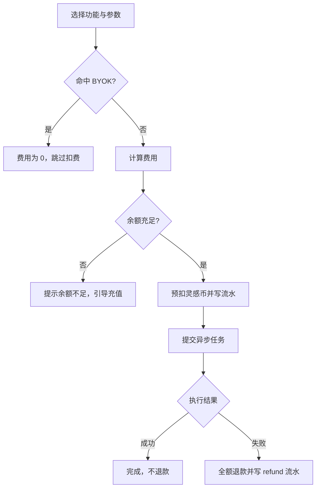

### 4.6 界面说明

- **充值中心** `views/PurchaseView.vue`：套餐列表、兑换码核销、个人/团队充值目标切换、余额展示。
- **钱包选择** `components/common/WalletCostPanel.vue`：在工具箱各页面提供个人/团队钱包切换与余额提示，余额不足时禁用提交。
- **费用徽章** `components/common/ToolCostBadge.vue`：展示单次功能消耗；未配置定价时显示「免费」。
- **顶部栏** `components/layout/AppHeader.vue`：常驻显示当前钱包与余额。

---

## 5. 多语言 / 多站点提示词引擎

### 5.1 设计目标

把「站点 → 语言」「中文场景 → 英文环境描述」「图型 → 提示词模板」三件事从代码中剥离为可热更新的字典，使新增站点或调整场景描述无需改代码。

### 5.2 架构

| 组件 | 位置 | 职责 |
| --- | --- | --- |
| 多语言引擎 | `services/multilang_engine.py` | 纯函数模块：站点归一、图型归一、卖点校验、提示词组装 |
| 站点语言字典 | `config/dictionaries/site_languages.json` | 站点码、非拉丁语区站点、默认语言 |
| 场景环境字典 | `config/dictionaries/scene_env_mappings.json` | 中文场景 → 英文环境描述 |
| 提示词构建器 | `prompts/builder.py` | 按图型 + 品类 + 平台组装提示词 |
| 品类识别 | `prompts/pro/templates/categories.py` | 从商品名称/品类线索推断品类，输出品类默认参数 |

字典文件带 mtime 缓存，修改 JSON 后无需重启即可生效。

### 5.3 核心算法

**图型归一**：把历史遗留的多种命名统一为三类主图型。

```
main_image / white_bg                  → main   （主图：纯白底、无文字）
scene / sub_image / selling_point      → scene  （场景图：允许场景与模特）
detail / material / size_chart /
checklist / other                      → detail （细节图：微距特写）
```

**站点归一**：非法站点回退为 `US` 并记录 warning，不抛异常中断批量任务。

**双语卖点校验** `validate_selling_point`：要求 `zh_title` / `zh_desc` / `en_title` / `en_desc` 均非空，英文字段不得包含中文，`visual_keywords` 非空且为纯英文。前端在失焦时即时校验并阻止提交。

**文字语言约束**：主图不追加文字约束；非拉丁语区站点（如日本、俄罗斯、阿拉伯语区）会追加「必须使用本地文字、禁止乱码字符」的约束，避免生成乱码。

### 5.4 提示词组装流程

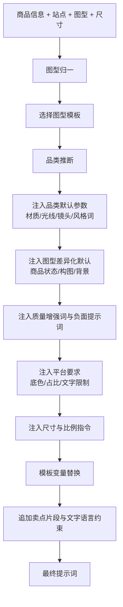

### 5.5 提示词模板体系

```
prompts/
├── builder.py                # PromptBuilder 主构建器
├── main_image.txt ...        # 英文富模板（含 {变量} 占位符）
├── zh/                       # 同名中文模板
└── pro/
    ├── guidelines.py         # 结构顺序、质量增强词、平台要求、负面提示词
    ├── main_image.txt ...    # 专业模式简版模板
    └── templates/
        ├── categories.py     # 品类识别与品类默认参数（当前生效路径）
        └── <品类>/            # 分品类模板文件（当前未被调用，见下方说明）
```

支持的品类：`electronics`、`beauty`、`home_garden`、`food_beverage`、`fashion`、`sports_outdoor`，未命中时回退通用参数。

> 说明：`prompts/pro/templates/<品类>/` 下的分品类 txt 模板由 `CategoryTemplateLoader` 加载，但该加载器在当前代码中**没有调用方**（源码注释亦标注为保留以防导入错误）。**当前实际生效的品类适配**是通过 `categories.py` 的品类默认参数注入模板变量实现的。

### 5.6 使用流程与界面

在「AI 商品图 - 简单模式」面板中：

1. 选择投放站点 → 引擎自动带出对应语言与是否非拉丁语区。
2. 选择场景风格 → 引擎映射为英文环境描述。
3. 填写或由「AI 帮写」生成中英双语卖点。
4. 点击「预览提示词」（`POST /api/v1/template/preview`）可在不调用模型、不计费的前提下查看最终提示词。

---

## 6. 平台合规模块

合规能力分为**生成前预校验**与**生成后视觉审查**两段，分别由两个服务承担。

### 6.1 架构

| 文件 | 阶段 | 职责 |
| --- | --- | --- |
| `services/compliance_service.py` | 生成前 | 提示词关键词预校验、平台约束注入 |
| `services/compliance_review_service.py` | 生成后 | 调用多模态模型对成图做视觉审查 |
| `models/compliance.py` | — | 读取 `platform_compliance_rules` 表 |
| `routes/compliance_routes.py` | — | 规则查询与单图审查接口 |

### 6.2 规则库

规则存储在 `platform_compliance_rules` 表，按「平台 × 图型」唯一。内置 6 个平台：

| 平台 | 主图背景要求 | 主图商品占比下限 | 主图尺寸下限 |
| --- | --- | --- | --- |
| `amazon` | 纯白 RGB(255,255,255) | 85% | 1600 px |
| `temu` | 纯白 RGB(255,255,255) | 80% | 1350 px |
| `shopee` | 白色或浅色纯色背景（建议） | 70% | 1024 px |
| `tiktok_shop` | 纯白 RGB(255,255,255) | 80% | 1080 px |
| `aliexpress` | 纯白 RGB(255,255,255) | 85% | 1000 px |
| `ozon` | 白色或浅色纯色背景 | 70% | 900 px |

另有一套**平台级通用禁元素**，分两级严重度：

| 严重度 | 禁元素 |
| --- | --- |
| `block`（阻断） | 竞品品牌词/Logo、二维码/条码、水印、联系方式/网址 |
| `warning`（警告） | 物流与促销文字、夸大宣传与绝对化用语 |

规则在后端启动时按平台粒度自动补齐种子数据，存在即跳过。

### 6.3 生成前预校验

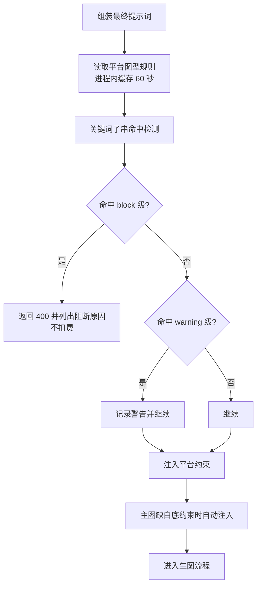

要点：

- 预校验**发生在扣费之前**，命中阻断项直接返回 400，用户不会被扣费。
- 平台约束注入仅针对主图（白底、占比、无文字），且做了幂等判断，不会重复注入。
- 数据库异常时降级为空规则，不阻断业务流程。

### 6.4 生成后视觉审查

- 由 `compliance_review_service.review_image` 调用多模态模型，输入支持外链 URL、本地 `/api/v1/images/...` 路径（读盘转 base64）或 base64 数据。
- 输出结构：

```json
{
  "riskLevel": "high | medium | low | unknown",
  "issues": [ { "rule": "规则名", "detail": "命中说明" } ],
  "fixSuggestions": ["整改建议"]
}
```

- 模型被要求返回 JSON；解析或调用失败会重试 1 次（共 2 次），仍失败则返回 `riskLevel: unknown` 并附 `review_error`，**不阻断主流程**。
- 批量套图中，每个子任务完成后自动触发审查（受 `COMPLIANCE_REVIEW_ENABLED` 开关控制），结果写入 `batch_task_item.review`。
- 平台无规则时使用通用电商图审查要点兜底。

### 6.5 界面说明

- 简单模式面板中，选择平台后会实时展示该平台的合规摘要（底色、占比、文字限制）。
- 提交前若存在阻断项，配置面板会列出全部阻断原因并禁用生成按钮。
- 批量面板中每个子任务带审查徽标，按风险等级着色（高/中/低/未知），可展开查看命中的规则与整改建议。

---

## 7. AI 商品图 - 简单模式

### 7.1 定位

面向「一次上传、成套产出」的批量铺货场景：上传商品图，选择站点与场景，系统自动生成主图、场景图、细节图等多张商品图。

### 7.2 架构

| 文件 | 职责 |
| --- | --- |
| `routes/generation.py` | 接口：AI 帮写、提交生成、查询任务/批次、重试、删除 |
| `workflows/smart_generation.py` | LangGraph 状态图工作流 |
| `services/generation_service.py` | 多模态分析、LLM 调用、生图调用的通道化封装 |
| `prompts/builder.py` | 提示词组装 |
| `services/multilang_engine.py` | 站点约束增强 |
| `services/compliance_service.py` | 合规预校验与平台约束注入 |

### 7.3 工作流状态图

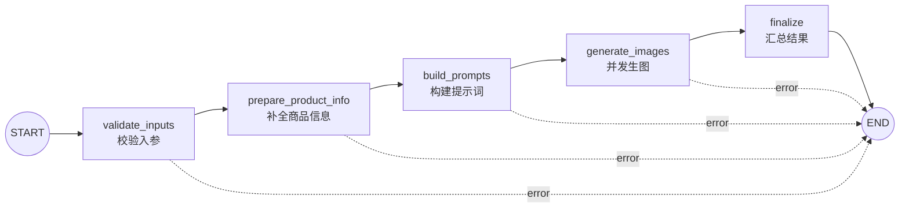

各节点均带 `error` 条件路由，任一环节失败即终止并记录错误。

### 7.4 核心算法

**商品信息补全** `prepare_product_info`：解析入参中的商品信息，若关键字段不完整，自动调用多模态模型分析商品图并回填（含中英双语卖点）。

**AI 帮写**：`POST /api/v1/generation/analyze-product` 独立接口，多模态分析商品图后返回结构化商品信息，用于前端表单自动填充。

**并发生图**：`generate_images` 节点使用线程池（最多 5 并发）调用生图接口，**每完成一张立即写入任务存储**，因此前端能逐张看到结果，而不是等全部完成。

**退款策略**：仅当**全部任务失败**时才退款，退款额以预扣金额封顶；部分成功视为已消耗资源，不退款。BYOK 命中时费用为 0，跳过退款逻辑。

### 7.5 使用流程

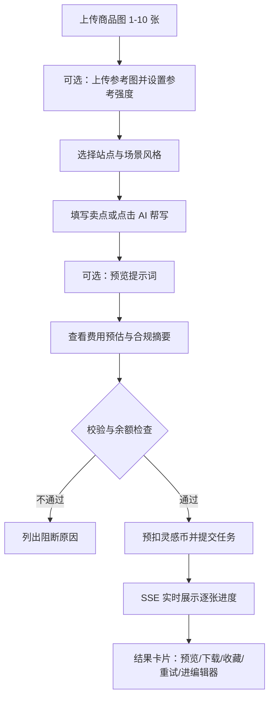

### 7.6 界面说明

- **左侧资产面板** `components/workspace/AssetPanel.vue`：商品图与参考图上传（支持拖拽）、参考方向多选（色彩/构图/光影/整体风格）、自定义参考描述、费用预估与生成按钮。
- **配置面板** `components/workspace/ConfigPanel.vue`：模式切换（简单/专业）、内嵌对应模式组件、费用估算、生成按钮；提交前做英文卖点校验与余额校验，并展示合规阻断列表。
- **简单模式面板** `components/workspace/SmartMode.vue`：站点选择器（含语言与 RTL 标记）、平台选择器（联动合规摘要）、场景风格、提示词与「AI 帮写」。
- **结果画布** `components/workspace/CanvasArea.vue`：网格展示生成结果，含预览弹层、收藏、下载、重试；顶部显示生成进度计数。
- **结果卡片** `components/common/ImageCard.vue`：支持渐进式加载、提示词展开，并可一键跳转到编辑器（`/editor?imageId=<url>`）。

---

## 8. AI 商品图 - 专业模式

### 8.1 定位

面向单品精修场景：对每一张图单独生成提示词方案，允许用户通过对话反复打磨方案，确认后再统一生图。

### 8.2 三阶段流程

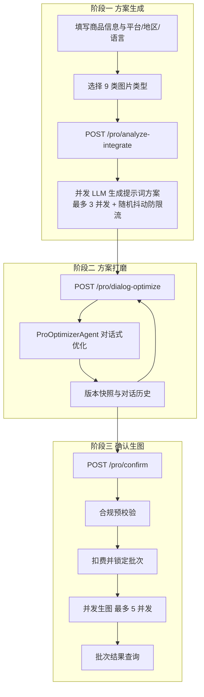

### 8.3 核心组件

**方案优化 Agent** `agents/pro_optimizer_agent.py`：

- 每个「批次 + 任务」一个实例，按 `batch_id:task_id` 缓存。
- 维护记忆：最近 20 条优化决策摘要，用于让模型理解历史调整意图。
- 每次优化输入：当前方案 + 记忆摘要 + 最近 10 轮对话 + 本轮指令。
- 输出 `{scheme, reply}`，逐字段做兜底（缺失字段保留原值），避免模型输出不完整导致方案损坏。

**方案结构**：每张图对应一个提示词方案，包含：

| 字段 | 说明 |
| --- | --- |
| `image_name` | 图片名称 |
| `image_role` | 图片角色（主图/场景图/细节图等） |
| `layout_prompt` | 布局提示词（商品状态、构图、背景、视觉焦点） |
| `copy` | 文案（主标题、副标题、标签、角标） |

**一键补全** `POST /pro/auto-fill-schemes`：为空白或生成失败的方案重新调用模型生成，便于快速补齐。

### 8.4 使用流程与界面

`components/workspace/ProMode.vue` 提供三段式界面：

1. **基础设置**：平台、地区、语言、图片比例、分辨率、自定义尺寸、需求文本；下方是 9 类图片类型的勾选列表。
2. **方案编辑**：逐张展示生成的方案，可直接编辑提示词与文案；支持「预览提示词」查看最终效果；支持对话式优化（右侧对话区输入调整意图）。
3. **确认生图**：确认后进入生图，SSE 推送批次进度，完成后展示结果。

---

## 9. 批量套图编排

### 9.1 定位

面向「多商品 × 多站点 × 多图型」的规模化生产，强调**可预估成本、可断点续跑、可对账**。

### 9.2 架构

| 文件 | 职责 |
| --- | --- |
| `routes/batch_routes.py` | 提交批次、清单查询、断点续跑 |
| `services/batch_orchestrator.py` | 任务展开、费用预估、批次执行 |
| `services/style_lock.py` | 批次级风格锁定 |
| `models/batch_task.py` | `batch_task` / `batch_task_item` 数据访问 |

### 9.3 任务展开算法

```
子任务集合 = 商品 × 站点 × 图型  （笛卡尔积）
去重键 item_key = {product_id}_{site}_{image_type}
```

- 去重键超长时用 MD5 兜底。
- 支持**图组预设** `image_group`：当前内置 `tiktok_showcase`，固定为
  - `main` 1024×1024
  - `scene` 1024×1024
  - `detail` 1024×1820（竖版 9:16）
- 费用预估 `estimate_cost`：逐项按**自身尺寸**计算费用并写回 `item.coins`，因此图组预设中不同尺寸的项单价可以不同。

### 9.4 提交链路

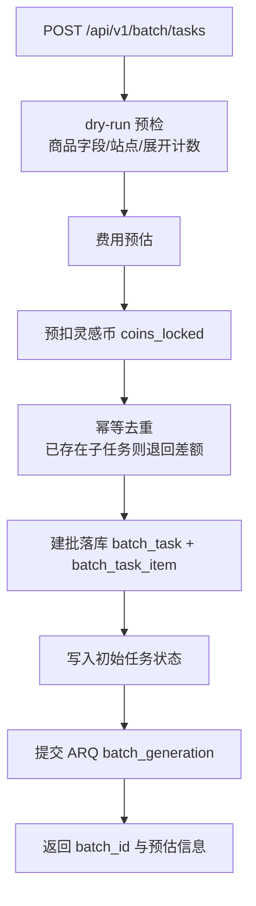

规模上限（超出即拒绝）：

| 维度 | 上限 |
| --- | --- |
| 商品数 | 50 |
| 站点数 | 20 |
| 图型数 | 10 |
| 子任务总数 | 500 |

### 9.5 执行算法

- 分批执行，`BATCH_SIZE = 5`。
- 批次开始时**派生一次风格锁定**，前置到每个子任务的提示词（详见第 10 节）。
- **失败隔离**：单个子任务失败不中断整个批次，记录错误后继续。
- **失败即时退款**：失败子任务立即全额退款并把该子任务 `coins` 置 0。
- **进度聚合**：每个子任务结束重算计数器并发布批次级进度事件。
- **断点续跑**：`list_retry_items` 只取 `failed` 与 `planned` 状态的子任务，不重复扣费。

### 9.6 批次状态机

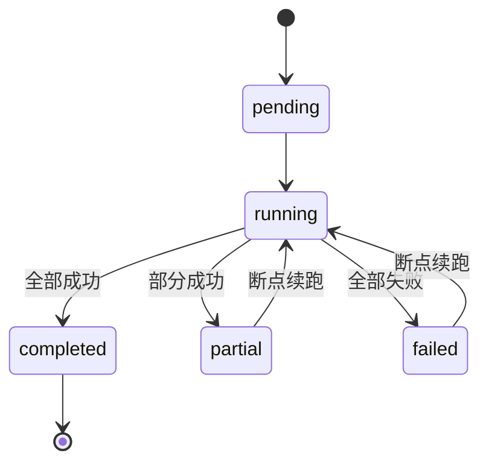

子任务状态机：`planned → running → completed | failed`。

### 9.7 界面说明

`components/workspace/BatchPanel.vue` 是工作台底部的批量面板：

- 站点多选、图型多选；选择 TikTok 时展示图组预设（固定 main + scene + detail）与尺寸提示。
- 实时展示预估张数、单价与灵感币总额、风格锁定提示。
- 提交前弹出确认层，列出批次规模与费用。
- 提交后展示批次进度、逐项结果与审查徽标；失败项可一键重试。
- 预检失败时把 400 返回的原因归一化后展示给用户。

---

## 10. 风格锁定

### 10.1 设计目标

同一批次的图片需要保持统一的视觉风格。若每张图独立生成提示词，容易出现色调、光线、构图不一致的问题。

### 10.2 实现原理

`services/style_lock.py` 是一个**纯函数模块**：相同输入恒定产生相同输出，无数据库访问、无网络调用、无随机数。这保证了同批次每张图拿到的是完全一致的风格约束。

算法步骤：

1. **品类匹配**：从商品品类线索文本中匹配 8 类风格之一：

| 品类键 | 覆盖范围 |
| --- | --- |
| `electronics` | 3C 电子 |
| `beauty` | 美妆个护 |
| `home` | 家居 |
| `food` | 食品饮料 |
| `outdoor` | 运动户外 |
| `apparel` | 服装鞋包 |
| `toy` | 玩具 |
| `jewelry` | 珠宝配饰 |

未命中时使用默认风格兜底。

2. **场景覆盖**：命中场景关键词时，用场景对应的光线配置覆盖品类默认光线（例如「夜景」场景会覆盖为低照度暖光）。
3. **生成约束文本**：输出以 `STYLE LOCK: ` 开头的英文约束段，包含色板、光线、构图、氛围四项，并可附加平台与用户提示。

```
STYLE LOCK: [色板], [光线], [构图], [氛围].
Apply consistently across this batch: ...
```

4. **长度控制**：约束文本限制在 60 个词以内；超出预算时优先舍弃用户提示后重建。

### 10.3 使用点

| 场景 | 派生时机 |
| --- | --- |
| 批量套图 | 批次开始时派生一次，复用到全部子任务 |
| 专业模式 | 批次确认生图时派生一次 |

每张图的提示词会**前置**同一段锁定文本，且做了幂等判断（已包含则不重复追加）。

---

## 11. AI 图片编辑器

### 11.1 定位

提供一个基于图层的在线编辑器，既有常规图像编辑能力，也能通过自然语言驱动多步 AI 编辑。

### 11.2 架构

| 文件 | 职责 |
| --- | --- |
| `routes/editor_routes.py` | 工具列表、工具执行、任务查询、文档 CRUD、Agent 接口 |
| `controllers/editor/tools/registry.py` | 工具注册表（单一数据源） |
| `controllers/editor/tools/imaging.py` | 基础图像工具实现 |
| `controllers/editor/tools/ai_imaging.py` | AI 图像工具实现 |
| `controllers/editor/tools/tasks.py` | 工具执行的 ARQ 任务 |
| `controllers/editor/agent/planner.py` | 自然语言 → 执行计划（LangGraph） |
| `controllers/editor/agent/validate.py` | 计划校验与拓扑排序 |
| `controllers/editor/agent/executor.py` | 计划执行的 ARQ 任务 |
| `controllers/editor/layers.py` | 图层文档结构校验 |

### 11.3 工具清单

工具注册表 `EDITOR_TOOLS` 是唯一数据源，前端通过 `GET /api/v1/editor/tools` 动态渲染工具栏。

| 工具名 | 展示名 | 分类 | 关键参数 |
| --- | --- | --- | --- |
| `color_adjust` | 色彩调整 | 基础 | 亮度/对比度/饱和度/色温（-100 ~ 100） |
| `crop` | 裁剪 | 基础 | x / y / width / height（必填整数） |
| `flip` | 翻转 | 基础 | 水平/垂直（至少一项） |
| `rotate` | 旋转 | 基础 | 角度 ∈ {90, 180, 270} |
| `remove_background` | AI 抠图 | AI | 无 |
| `replace_background` | AI 换背景 | AI | 背景提示词（必填） |
| `inpaint_erase` | AI 消除 | AI | 蒙版数据（必填） |
| `inpaint_replace` | AI 局部重绘 | AI | 蒙版数据 + 提示词（必填） |
| `upscale` | AI 高清放大 | AI | 倍数 ∈ {2} |

工具函数统一签名：`func(image: PIL.Image, params: dict) -> PIL.Image`；AI 工具额外透传 `user_id` 以支持 BYOK 通道解析。参数由 `validate_params` 做类型、必填、范围、整数与枚举校验。

### 11.4 AI 工具的实现与降级

AI 工具复用图像生成通道的 `POST /images/edits` 接口。为保证可用性，每个工具都实现了本地降级：

| 工具 | 主路径 | 降级路径 |
| --- | --- | --- |
| AI 抠图 | 通道生成纯白底主体图，再用边缘泛洪去白底 | 通道不可用时直接对原图做泛洪去背 |
| AI 消除 | `images/edits` + 蒙版 | PIL 扩散填充（多级下采样 + 模糊回贴） |
| AI 局部重绘 | `images/edits` + 蒙版 | 扩散填充兜底（**无法真正按提示词生成内容**） |
| AI 高清放大 | 通道高清重绘后精确缩放回 2 倍 | LANCZOS 2 倍放大 + USM 锐化 |

> 前端约定：蒙版数据中「白色 = 选区」，调用前会反相为透明区域。

### 11.5 Agent 编排流程

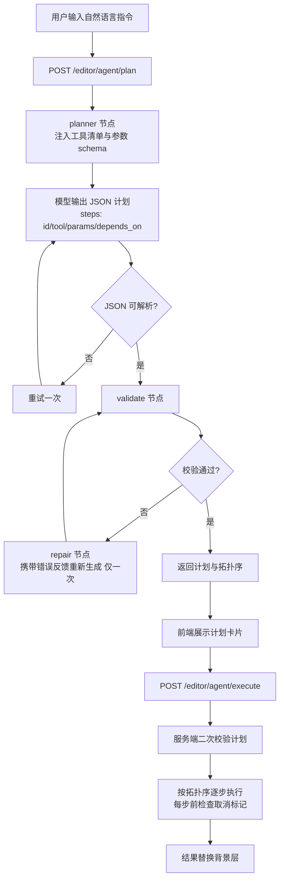

**计划校验** `validate.py` 包含五类检查：

1. 结构检查：步骤非空、ID 唯一。
2. 工具与参数检查：工具必须存在，参数需通过 schema 校验。
3. 依赖检查：引用的步骤必须存在，禁止自依赖。
4. **依赖补全**：若同时存在「AI 抠图」与「AI 换背景」，自动为后者补上前者依赖（不新增步骤）。
5. 环检测与拓扑排序：DFS 三色标记检测循环依赖，Kahn 算法输出执行顺序。

**执行器** `executor.py`：

- 服务端会**二次校验计划**，防止绕过规划接口直接投递任意工具调用。
- 每步执行前检查 Redis 中的取消标记，支持中途取消。
- 中间产物落盘并把 URL 写入 Redis，支持**单步重试**时复用已完成的步骤产物。
- 步骤失败默认终止整个计划，错误信息中携带失败步骤与已完成步骤列表。

### 11.6 图层文档

图层结构（存于 `editor_document.layers` JSON 字段）：

| 字段 | 类型 | 说明 |
| --- | --- | --- |
| `id` | string | 图层唯一标识 |
| `type` | `image` \| `text` | 图层类型 |
| `url` | string | 图片地址（`image` 类型必填） |
| `text` | string | 文本内容（`text` 类型必填） |
| `x` / `y` / `width` / `height` | number | 位置与尺寸（必填） |
| `rotation` / `opacity` / `visible` / `locked` / `z` | 可选 | 旋转、不透明度、显隐、锁定、层级 |

`validate_layers` 会逐层校验类型、必填项、数值范围与布尔值。

### 11.7 界面说明

`views/editor/EditorView.vue` 采用三栏布局：

- **左栏** `EditorToolbar.vue`：按分类渲染工具按钮，点击激活工具（再次点击取消）。
- **中栏** `EditorCanvas.vue`：基于 vue-konva 的画布，支持滚轮缩放、空格拖拽平移、选中拖拽缩放、裁剪框、蒙版笔刷涂抹（Enter 确认选区）；提供按原图分辨率导出的能力。
- **右栏**：图层页签 + AI 助手页签（用 `v-show` 保持挂载，避免切换时中断 SSE 连接）。
  - `EditorLayerPanel.vue`：图层列表、显隐/锁定、上移下移、删除、上传图片为图层、新增文本图层。
  - `EditorPropertyPanel.vue`：图层变换属性 + 激活工具参数（按参数 schema 动态渲染）。
  - `EditorAgentPanel.vue`：自然语言指令 → 计划卡片 → 执行进度 → 结果；支持取消后续步骤与失败步骤单步重试。
  - `EditorMaskBrushPanel.vue`：笔刷直径滑杆、清空重涂、生成蒙版。
- **顶栏**：标题编辑、保存状态（idle/dirty/saving/saved/error）、上传、下载、前后对比（`EditorCompareOverlay.vue`，可拖拽分割线）、保存到历史。
- **快捷键**：`Ctrl+Z` 撤销、`Ctrl+Y` 重做（输入框内不拦截）。

编辑器的自动保存策略：编辑后 800 毫秒防抖保存；若文档尚未创建则先 `POST` 创建再 `PUT` 更新；本地保留最多 50 步撤销栈。

---

## 12. AI 工具箱

### 12.1 工具一览

| 工具 | 前端页面 | 执行方式 | feature_key |
| --- | --- | --- | --- |
| 生图计划分析 | `toolbox/PlanAnalysisView.vue` | 异步 | `toolbox.plan_analysis` |
| 图片合并 | `toolbox/ImageMergeView.vue` | 异步 | `toolbox.image_merge` |
| 文生图 | `toolbox/TextToImageView.vue` | 同步 | `toolbox.text_to_image` |
| 对话式生图 | `toolbox/ChatGenView.vue` | 同步 | `toolbox.chat_gen` |
| 产品替换 | `toolbox/ProductReplaceView.vue` | 异步 | `toolbox.product_replace` |
| AI 模特 | `toolbox/AiModelView.vue` | 同步 | `toolbox.ai_model` |
| 模特商品图 | `toolbox/ModelProductView.vue` | 异步 | `toolbox.model_product` |
| 反推提示词 | `toolbox/PromptReverseView.vue` | 同步 | `toolbox.prompt_reverse` |

所有工具页统一使用 `ToolCostBadge`（消耗徽章）与 `WalletCostPanel`（钱包选择与余额校验），成功后本地同步余额。

### 12.2 生图计划分析

输入商品图与说明文档，输出一套完整的生图计划（建议 6-8 张图，每张含标题、方案说明、选择理由、中英文提示词与备用提示词）。

**文档解析**：纯文本文件（txt / md / json）直读；PDF / Word / PPT / Excel / 图片走 MinerU 解析，流程为「创建解析任务 → 上传文件 → 轮询结果（最多 60 次 × 5 秒）→ 下载 Markdown」，并带三层降级（正常重试 / 自定义 SSL 上下文 / 跳过 SSL 校验）。

**结果缓存**：以输入内容哈希为键缓存结果，缓存时长由 `ANALYSIS_CACHE_TTL` 控制（默认 3600 秒），命中缓存直接返回，不重复计费。

**大文件上传**：支持分块上传（init / chunk / complete / status 四类接口），分片大小由 `CHUNK_SIZE` 控制。

**前端交互**：提交后每 2 秒轮询一次，最多 300 次（约 10 分钟）。

### 12.3 图片合并

将 2-10 张图片智能合并为一张，并保持商品一致性。五步流程：

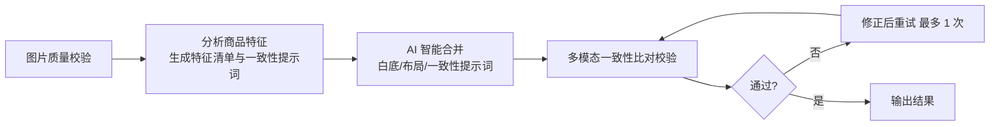

### 12.4 文生图

- 调用 `images/generations` 接口。
- 尺寸校验规则：最长边 ≤ 3840、边长为 16 的倍数、长短边比 ≤ 3:1、像素总数在 655,360 ~ 8,294,400 之间。
- 前端提供 1024×1024 / 1536×1024 / 1024×1536 / 2048×2048 预设与自定义尺寸；自定义尺寸会经 `validateAndCorrectSize` 自动修正并提示。

### 12.5 对话式生图

多轮对话式生成，最多可携带 3 张参考图；支持 Enter 发送、Shift+Enter 换行、图片灯箱放大与下载。

### 12.6 产品替换

商品图 + 参考图 + 可选提示词，异步执行并支持 SSE 进度订阅。

### 12.7 AI 模特

上传可选人物图，选择国家（25 国下拉）与人种（8 项），同步返回生成结果。

### 12.8 模特商品图

商品图 + 模特图 + 提示词 + 分辨率与比例。后端六步流程：

```
分析商品图 → 分析模特图 → 判断提示词详细度 → 确定最终提示词 → 文生图 → 完成
```

提示词详细度判断：若不足 3 个维度，会自动优化为更详细的英文提示词再生成。

> 该工具的退款逻辑放在**状态查询接口**中执行，并用任务级标记防止重复退款。

### 12.9 反推提示词

上传图片（≤ 20 MB），同步返回中文与英文提示词，支持一键复制。

---

## 13. 历史记录与收藏

### 13.1 历史记录

所有生成与工具结果都会写入 `history_records` 表：

| 字段 | 说明 |
| --- | --- |
| `category` | 一级类目：`ai_product_image` / `ai_toolbox` |
| `sub_category` | 二级类目标识符 |
| `input_data` / `output_data` | 输入与输出数据（JSON） |
| `config_snapshot` | 配置快照，用于「再次生成」 |
| `shared_to_team` / `shared_team_id` | 团队分享状态 |

缩略图统一生成 WebP 格式（small 200×200、medium 400×400），列表页按需生成。

### 13.2 收藏

`favorites` 表支持两种收藏类型：

- `image`：收藏单张图片。
- `history`：收藏整条历史记录（含团队共享的记录）。

### 13.3 界面说明

- `views/HistoryView.vue`：我的历史 / 团队历史切换、分类与子分类筛选、分页、详情弹层、删除、收藏。
- `views/FavoritesView.vue`：收藏列表、下载、取消收藏、查看详情、按配置快照再次生成。
- `components/history/HistoryDetail.vue`：历史详情弹层，展示输入输出与配置快照。

---

## 14. 团队协作模块

### 14.1 能力

| 能力 | 说明 |
| --- | --- |
| 创建团队 | 指定团队名称与品类，创建者成为 owner |
| 邀请码加入 | 10 位邀请码，默认有效期 7 天、最大使用 5 次，可刷新 |
| 成员管理 | 成员列表，角色分 owner / admin / member |
| 团队钱包 | 团队共享余额，支持个人向团队转账 |
| 转账日志 | 完整记录转账类型、金额、状态与失败原因 |
| 历史共享 | 个人历史可分享到团队，团队成员可见 |

### 14.2 邀请码安全设计

邀请码采用「哈希 + 加密」双存储：

- `invite_code_hash`：SHA-256 哈希，用于快速查找校验。
- `invite_code_encrypted`：AES-256-CBC 加密的原始邀请码，用于向团队管理员回显。

加密密钥由 `INVITE_CODE_ENCRYPTION_KEY` 提供，与用户 API Key 加密密钥相互隔离。

### 14.3 界面说明

`views/TeamView.vue`：创建/加入团队、邀请码展示与刷新、成员列表、解散团队、向团队钱包转账、转账流水查看。

---

## 15. 自带模型通道（BYOK）

### 15.1 设计目标

允许用户配置自己的模型服务商，开启后对应功能不消耗灵感币，同时降低平台侧成本。

### 15.2 通道分类与号池

| 分类常量 | 用途 |
| --- | --- |
| `image_gen` | 图像生成与编辑 |
| `multimodal` | 图片理解、合规审查、反推提示词 |
| `llm` | 文案生成、方案优化、Agent 规划 |

每个分类下可配置多条服务商条目，按 `priority` 升序组成**号池**：调用时依次尝试，成功则记录使用时间，失败则累加失败计数并尝试下一条。

### 15.3 通道解析逻辑

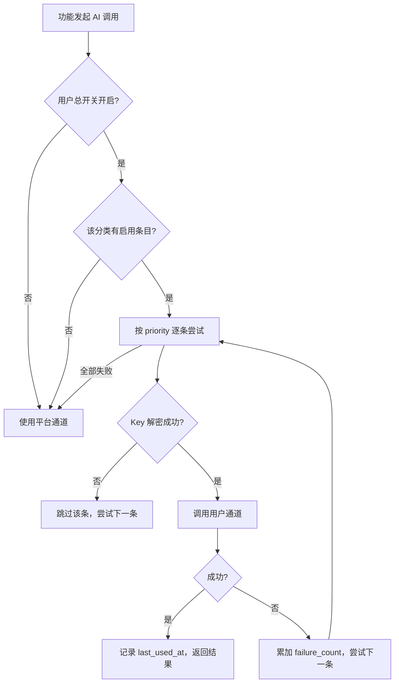

任何异常（未开启总开关、该分类无启用条目、数据库异常）都会**安全回退到平台通道**，不影响功能可用性。

### 15.4 计费联动

- `FEATURE_CHANNEL_MAP` 定义每个功能涉及哪些分类。
- `is_feature_byok`：总开关开启**且**该功能涉及的全部分类下都有启用条目时，判定为命中 BYOK。
- `calculate_effective_cost`：命中 BYOK 返回 0，否则返回平台原价。

### 15.5 安全设计

| 措施 | 说明 |
| --- | --- |
| 加密存储 | API Key 使用 `USER_AI_KEY_ENCRYPTION_KEY` 做 AES-256-CBC 加密后存入 `api_key_cipher` 字段 |
| 掩码返回 | 接口只返回掩码形式（前 4 位 + `****` + 后 4 位），长度不足 8 位时返回 `****` |
| 密钥隔离 | 与邀请码加密密钥必须使用不同的值 |
| SSRF 防护 | 校验 `api_base` 必须是 http(s)、主机名可解析；解析出的任一 IP 若属于内网、保留、回环、链路本地、多播或云元数据地址（`169.254.169.254`）则拒绝；放行代理 fake-ip 网段 `198.18.0.0/15` |
| 连通性测试 | 提供测试接口，请求 `{api_base}/models` 并回写测试结果与错误信息 |

### 15.6 界面说明

`components/profile/AiProviderPanel.vue`（个人中心 → 模型通道页签，支持 `?tab=providers` 深链）：总开关、按分类分组的服务商列表、新增/编辑/删除、分类内上移下移调整优先级、连通性测试、掩码展示。

---

## 16. 管理后台

### 16.1 能力清单

| 模块 | 能力 |
| --- | --- |
| 仪表盘 | 请求量、成功率、模型调用延迟等统计（基于 `api_request_logs`） |
| 定价方案 | 充值套餐的增删改查与启停 |
| 功能定价 | 各功能计价配置的增删改查与启停，支持按功能键查询 |
| 团队消耗 | 团队维度的消耗统计 |
| 兑换码 | 创建、查询、删除兑换码，支持总次数与单账号次数上限 |
| 公告 | 公告增删改查、置顶与启停 |

### 16.2 权限

管理后台全部接口位于 `/api/v1/admin`，统一使用 `@token_required` + `@require_role('admin')` 保护。

> 注意：前端路由 `admin` 虽声明了 `meta.admin`，但导航守卫当前**未消费**该标记做拦截，实际权限由后端接口保证。若需前端也做拦截，需在守卫中补充判断。

### 16.3 界面说明

`views/AdminView.vue`：聚合仪表盘、定价方案、团队消耗、兑换码、公告、功能定价等页签；修改功能定价后会主动清除前端定价缓存。

---

## 17. 前端页面地图

### 17.1 路由表

| 路径 | 名称 | 页面 | 说明 |
| --- | --- | --- | --- |
| `/login` | `login` | `LoginView.vue` | 登录 / 注册（guest） |
| `/forgot-password` | `forgot-password` | `ForgotPasswordView.vue` | 找回密码（guest） |
| `/` | `home` | `HomeView.vue` | 首页 |
| `/workspace` | `workspace` | `WorkspaceView.vue` | AI 商品图工作台 |
| `/editor` | `editor` | `editor/EditorView.vue` | AI 图片编辑器 |
| `/toolbox/plan-analysis` | `toolbox-plan-analysis` | `toolbox/PlanAnalysisView.vue` | 生图计划分析 |
| `/toolbox/image-merge` | `toolbox-image-merge` | `toolbox/ImageMergeView.vue` | 图片合并 |
| `/toolbox/text-to-image` | `toolbox-text-to-image` | `toolbox/TextToImageView.vue` | 文生图 |
| `/toolbox/chat-gen` | `toolbox-chat-gen` | `toolbox/ChatGenView.vue` | 对话式生图 |
| `/toolbox/product-replace` | `toolbox-product-replace` | `toolbox/ProductReplaceView.vue` | 产品替换 |
| `/toolbox/ai-model` | `toolbox-ai-model` | `toolbox/AiModelView.vue` | AI 模特 |
| `/toolbox/model-product` | `toolbox-model-product` | `toolbox/ModelProductView.vue` | 模特商品图 |
| `/toolbox/prompt-reverse` | `toolbox-prompt-reverse` | `toolbox/PromptReverseView.vue` | 反推提示词 |
| `/history` | `history` | `HistoryView.vue` | 历史记录 |
| `/favorites` | `favorites` | `FavoritesView.vue` | 我的收藏 |
| `/team` | `team` | `TeamView.vue` | 团队管理 |
| `/purchase` | `purchase` | `PurchaseView.vue` | 充值中心 |
| `/orders` | `orders` | `MyOrdersView.vue` | 我的订单（列表接口尚未接入） |
| `/profile` | `profile` | `ProfileView.vue` | 个人中心（资料 / 安全 / 模型通道） |
| `/admin` | `admin` | `AdminView.vue` | 管理后台（`meta.admin`） |
| `/help` | `help` | `HelpCenterView.vue` | 帮助中心 |

`/toolbox` 会重定向到 `/toolbox/plan-analysis`。

### 17.2 导航守卫

`router.beforeEach` 逻辑：

- 等待认证状态加载完成（`auth.authLoading`）。
- 已登录访问 `meta.guest` 页面 → 跳转首页。
- 未登录访问非 guest 页面 → 跳转 `/login`。
- 其余放行。

### 17.3 状态管理

| Store | 职责 |
| --- | --- |
| `stores/auth.ts` | 用户、团队、双钱包、灵感币流水、登录令牌（`localStorage: ecomai_token`） |
| `stores/workspace.ts` | 工作台模式、商品图、生成结果、批次状态与进度、功能定价 |
| `stores/editor.ts` | 编辑器文档、图层、视口、工具与参数、撤销重做、自动保存、蒙版笔刷 |
| `stores/app.ts` | 侧边栏折叠状态 |

### 17.4 布局与公共组件

- `components/layout/AppLayout.vue`：主布局，含 `KeepAlive` 缓存 18 个视图（含全部工具箱页），避免切换页签丢失状态。
- `components/layout/AppHeader.vue`：用户菜单、钱包切换、余额展示、公告入口。
- `components/layout/AppSidebar.vue`：左侧导航，含可展开的 AI 工具箱子菜单与仅管理员可见的管理后台入口。
- `components/common/AnnouncementBar.vue`：顶部公告条，按启用状态、过期时间与置顶排序。
- `components/common/SkeletonLoader.vue`：骨架屏占位。

### 17.5 前端工具函数

| 文件 | 关键能力 |
| --- | --- |
| `src/lib/batch.ts` | 批量预估纯函数：站点码转市场码、商品 ID 生成、子任务数量预估 |
| `src/lib/error.ts` | 错误码到中文的映射、网络错误与后端英文消息的翻译 |
| `src/lib/utils.ts` | 尺寸体系校验与修正、比例与分辨率联动、成本与耗时估算、图片转 base64 |
| `src/api/client.ts` | 统一请求封装：`/api/v1` 基址、令牌注入、5 分钟超时、错误翻译、令牌失效自动清理 |
| `src/api/cache.ts` | 内存缓存与并发去重（默认 30 秒，长缓存 5 分钟） |

### 17.6 前端测试覆盖

| 测试文件 | 覆盖内容 |
| --- | --- |
| `__tests__/SmartMode-engine.spec.ts` | 站点选择与写回、模板选项失败降级、平台切换触发合规查询、英文卖点校验 |
| `__tests__/SmartMode-aiHelp.spec.ts` | 「AI 帮写」按钮的启用/禁用条件 |
| `__tests__/ConfigPanel-compliance.spec.ts` | 合规阻断原因展示、卖点校验不通过时拦截生成 |
| `__tests__/BatchPanel.spec.ts` | 批量纯函数、预估展示、TikTok 图组预设、审查徽标、失败项重试、提交契约与预检错误展示 |

---

## 附：模块与代码位置速查

| 想了解 | 看这里 |
| --- | --- |
| 应用启动做了什么 | `auth-module-backend/app.py` 的 `create_app()` |
| 有哪些异步任务 | `auth-module-backend/worker.py` 的 import 清单 |
| 提示词怎么拼 | `auth-module-backend/prompts/builder.py` |
| 站点与语言映射 | `auth-module-backend/config/dictionaries/site_languages.json` |
| 合规规则种子数据 | `auth-module-backend/app.py` 的 `_COMPLIANCE_SEEDS` |
| 工具清单 | `auth-module-backend/controllers/editor/tools/registry.py` |
| 接口约定 | `ecom-ai-studio/BACKEND_DEVELOPMENT_GUIDE.md` |
| 任务进度订阅 | `ecom-ai-studio/src/composables/useTaskSse.ts` |
